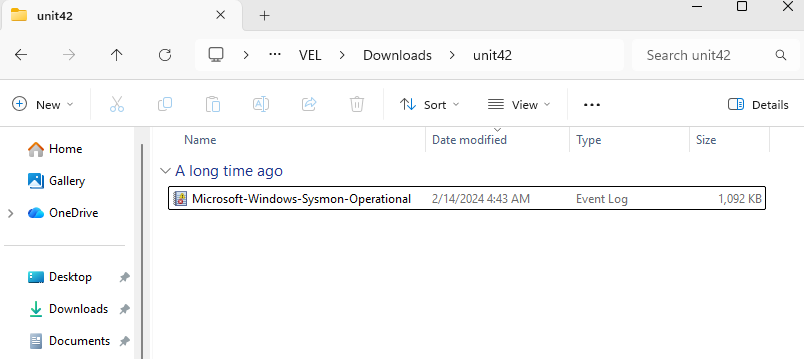
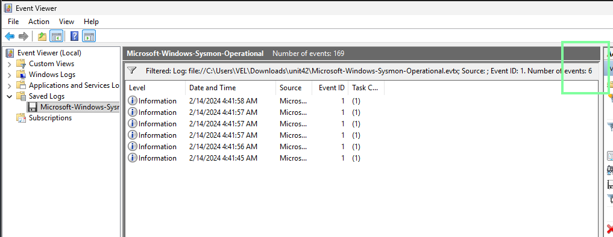
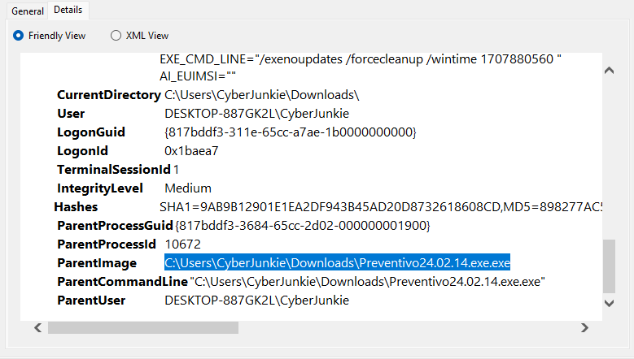

---
tags:
  - sherlock
  - dfir
difficulty: Very Easy
status: In Progress
date: 11:54 am - August 13, 2026
---

# Unit42

# Background
## Scenario

> In this Sherlock, you will familiarize yourself with Sysmon logs and various useful EventIDs for identifying and analyzing malicious activities on a Windows system. Palo Alto's Unit42 recently conducted research on an UltraVNC campaign, wherein attackers utilized a backdoored version of UltraVNC to maintain access to systems. This lab is inspired by that campaign and guides participants through the initial access stage of the campaign.
>
> To answer the questions in this lab, you will only need the Event Viewer, with VirusTotal as an optional supplement. Below are some important Sysmon Event IDs that can be utilized in your analysis:
>
> - Event ID 1: Process Creation/Execution. Includes process path, parent process path, and command-line arguments.
> - Event ID 2: File Creation Time Changed. Includes the file making the change, the file to which the change is being made, tampered timestamp, and original timestamp.
> - Event ID 3: Network Connection. Includes the process making the connection, destination IP Address, and port.
> - Event ID 5: Process Termination. Includes the name of the process that was killed or terminated itself.
> - Event ID 11: File Created. Includes the process creating the file, the file being created, and its full path.
> - Event ID 22: DNS Query. Includes the process querying the domain, the target domain name, and the IP Addresses they resolve to.

## Analysis

### Data
First, I see the provided zip contains an sysmon file, an event log type of file:

### Q & A

#### Task 1

*==How many Event logs are there with Event ID 11?==*

For this Sherlock, I'll be using the Windows Event Viewer. Now, by filtering for the event 11 in the provided log file, it's pretty easy to spot the total number of such events, **56**.

#### Task 2
*Whenever a process is created in memory, an event with Event ID 1 is recorded with details such as command line, hashes, process path, parent process path, etc. This information is very useful for an analyst because it allows us to see all programs executed on a system, which means we can spot any malicious processes being executed.* 
*==What is the malicious process that infected the victim's system?==*

Firstly, I'll check how many events with the Event ID 1 are there in the log file:

Because there are only 6 events of this type, I'll simply check manually in Event Viewer until I find anything unusual:

In the second event, the Details tab contains `technique_id=T1218`, which is associated with Signed Binary Proxy Execution. However, this alone does not indicate that the process is malicious, since `msiexec.exe` is a legitimate Windows executable.

Looking at the other fields, I find that `msiexec.exe` is being used to install an `.msi` file from an unusual location:

`CommandLine "C:\Windows\system32\msiexec.exe" /i "C:\Users\CyberJunkie\AppData\Roaming\Photo and Fax Vn\Photo and vn 1.1.2\install\F97891C\main1.msi"`

Finally, I check for the ParentImage which shows that the executable was launched from the user's Downloads folder:

**`ParentImage C:\Users\CyberJunkie\Downloads\Preventivo24.02.14.exe.exe`**

The process chain therefore shows:

`Preventivo24.02.14.exe.exe` → `msiexec.exe` → `main1.msi`

So to answer this particular question, the answer is: `C:\Users\CyberJunkie\Downloads\Preventivo24.02.14.exe.exe`

But to further confirm that this is a malicious file, I now get the SHA256 Hash from the actual Preventivo24.02.14.exe.exe event, the double `.exe` extension is also suspicious.
The hash is: `0CB44C4F8273750FA40497FCA81E850F73927E70B13C8F80CDCFEE9D1478E6F3`

And i check it in VirusTotal:

The file is heavily flagged in VirusTotal, providing strong evidence that `Preventivo24.02.14.exe.exe` is malicious.

#### Task 3

Which Cloud drive was used to distribute the malware?

#### Task 4

What was the timestamp changed to for the PDF file?

#### Task 5

Where was `once.cmd` created on disk? Please answer with the full path along with the filename.

#### Task 6

What domain name did the malicious file try to connect to?

#### Task 7

Which IP address did the malicious process try to reach out to?

#### Task 8

When did the malicious process terminate itself?

## Incident Timeline

| Timestamp (UTC) | Event | Source | Notes |
|-----------------|-------|--------|-------|
|                 |       |        |       |
|                 |       |        |       |
|                 |       |        |       |
|                 |       |        |       |
|                 |       |        |       |

## Lessons Learned / Key Findings / Important to remember

- 

## Related Techniques

- 

