---
tags:
  - sherlock
  - dfir
difficulty: Easy
status: Completed
date: 11:24 pm - September 15, 2026
---

# PHP-CGI_(CVE-2024-4577)


# Background

## Scenario

>You will confront an attempted exploitation of a newly discovered and unpatched vulnerability (CVE-2024-XXXX) in a critical software component within your organization's infrastructure. The CVE allows for remote code execution, posing a significant threat if successfully exploited. At 12:05 PM UTC, an alert is generated by the Intrusion Detection System (IDS) and Intrusion Prevention System (IPS), indicating an attack on one of your web servers. Your task is to analyze the provided artifacts, confirm the exploitation attempt, and answer the provided questions.

**CVE-2024-4577** is a **critical RCE vulnerability** in **PHP-CGI on Windows when used with Apache**.

The core issue is a **Windows character-conversion flaw**:

- Apache blocks normal `-` characters to prevent command-line injection.
    
- Attackers use an encoded **soft hyphen** such as `%ad` instead.
    
- Apache lets it through because it doesn't recognize it as a normal hyphen.
    
- Windows' **Best-Fit character mapping** converts `%ad` into `-`.
    
- `php-cgi.exe` then interprets it as a **command-line option**.
    
- Attackers can inject PHP options and potentially **execute arbitrary code on the server**.

## Analysis

### Data

Apart from a copy of Eric Zimmerman's toolset, the lab provides a .zip (`artifacts.7z`) file. When decompressed, 3 folders are extracted:

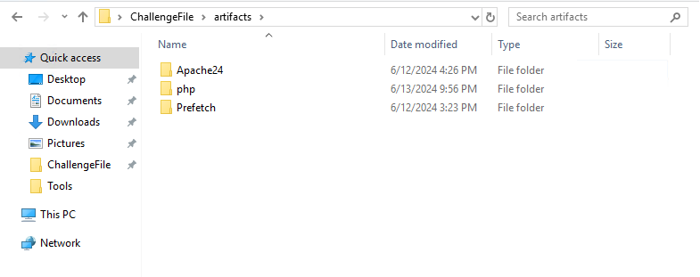


### Q & A

#### Task 0

***What version of PHP was running on the server during the incident?***

Some PHP distributions include a `news.txt` changelog, which may contain information about PHP versions and changes.

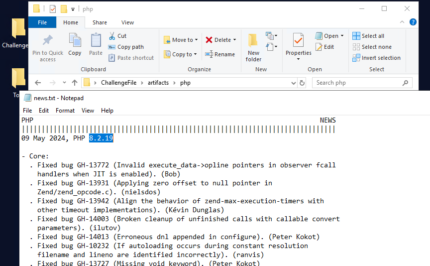

The version is listed right at the beginning of the file. The version number was: **8.2.19**. 
*Executing php.exe -v would have also been useful.*

#### Task 1

***When PHP is configured to run as CGI, which directive in httpd.conf specifies the scripts that handle requests for PHP files?***

As the question suggests, the directive is found in `httpd.conf`, located in the Apache24/conf folder.

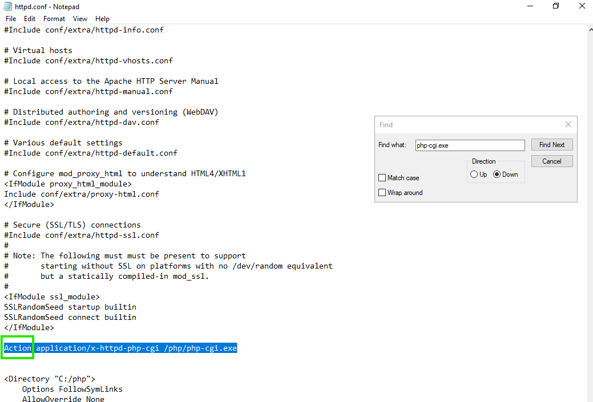

The asked directive/function is the famous: **Action**

#### Task 2

***What is the IP address of the attacker who attempted to exploit our server?***

Based on the `access.log` analysis, the attacker's IP address is **192.168.110.1**. This is confirmed by correlating repeated POST requests from this host with the `allow_url_include` vulnerability and character injection patterns (specifically utilizing `%ad`), outlined in the lab scenario. 

*The attacker appends a trailing **`d`** to the **`%ad`** sequence (resulting in **`%add`**) to inject the PHP **`-d`** command-line switch. This allows the attacker to override the **`allow_url_include`** configuration and leverage **`auto_prepend_file`** to achieve **Remote Code Execution (RCE)**.

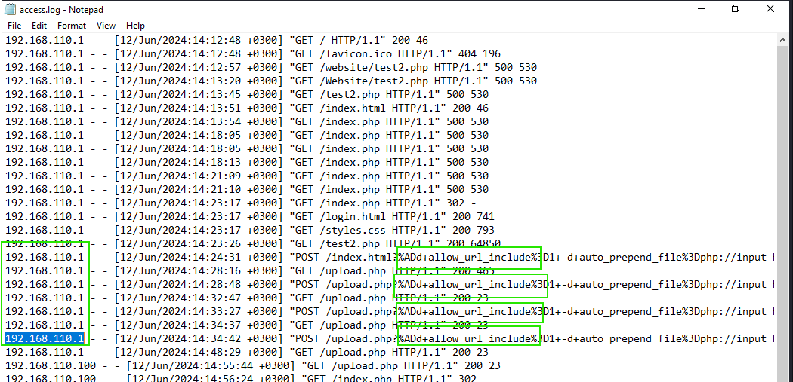

The `access.log` records initial malicious activity at distinct timestamps: 14:24, 14:28...

Further down in the log, additional exploitation attempts were also recorded between 15:03 and 15:05, this time with no GET requests in between, likely indicating succesful exploitation:

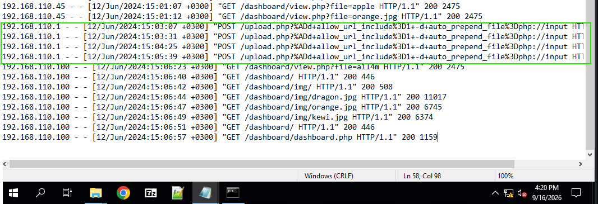

#### Task 3

***The attacker targeted a specific page on the server with malicious payloads. Which page did the attacker target with malicious payloads?***

The attacker mainly focused on **upload.php**:

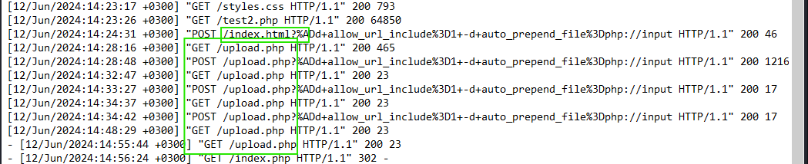

#### Task 4

***What version of Apache is running on the server?***

In the provided error.log, the version is found: **2.4.59**

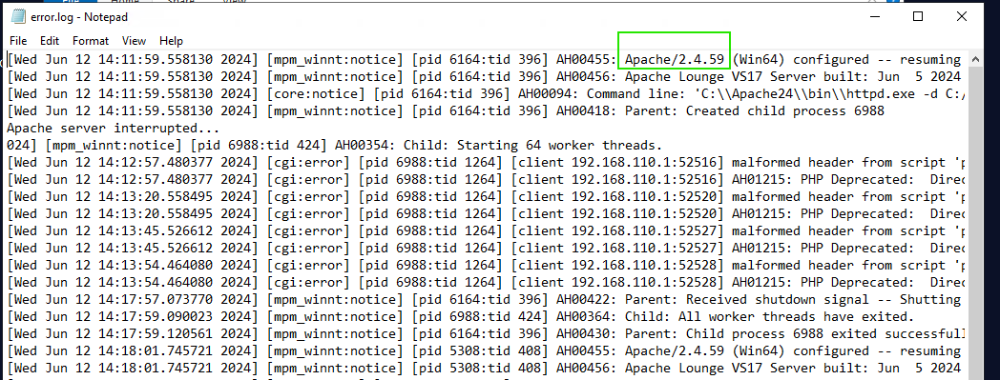

#### Task 5

***The attacker managed to execute commands on the server. What was the first process initiated by the attacker’s commands during their successful attempt?***

To answer this question, I went to the Prefetch folder, which contains the `.pf` files. 
Windows Prefetch files store binary evidence of executed applications, including run counts and execution timestamps.

Since these files are not human-readable, I utilized the provided tool PECmd.exe. PECmd.exe is *Eric Zimmerman's* tool for parsing **Windows Prefetch (`.pf`) files**.

First, I executed the tool with the command:

```bash
PECmd.exe -d "C:\Users\LetsDefend\Desktop\ChallengeFile\artifacts\Prefetch" --csv prefOutput
```

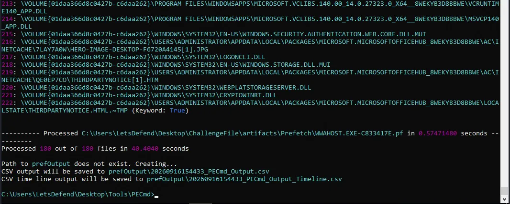

Before anything, I reopened the access.log file, and then I kept in mind the 3h ahead difference from the UTC Timestamp:

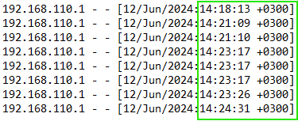

*This observation is important, since Prefetch timestamps are stored as Windows FILETIME values, which represent time in UTC.*

Then, I looked for the previously found timestamps (14:24 - 14:34 and **15:03 - 15:05**) in which occurred the exploitation attempts. Since I know the Apache Server was running 3h ahead of the UTC Timezone, I then opened the recently generated Timeline CSV and subtracted 3 hours from the web log timestamps when searching the Prefetch timeline.

Right there, at 15:03:14, a **WHOAMI.EXE** execution is found:

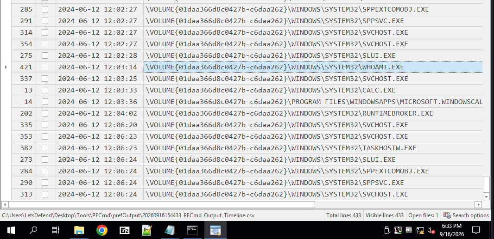

And the last execution of the PHP-CGI.EXE had occurred at 14:55:44:

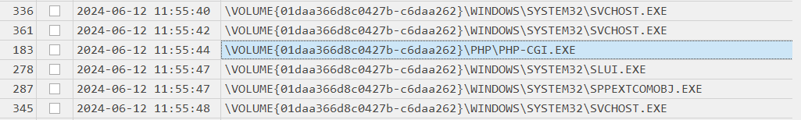

The process was: **whoami.exe**

#### Task 6

***Before the attacker was detected and blocked, they executed another command, launching a new process. What process was launched by this command?***

The second process was: **calc.exe**.

*Executing calc.exe from System32 is a well-known test attackers run to check their Remote Code Execution before any real payload is deployed.*

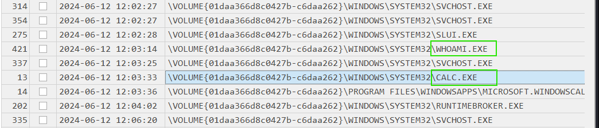


## Incident Timeline

| Timestamp (UTC)          | Event                   | Source                   | Notes                                                                                                                                    |
| ------------------------ | ----------------------- | ------------------------ | ---------------------------------------------------------------------------------------------------------------------------------------- |
| 2024-06-06 11:24 - 11:34 | Exploitation Attempts   | `Apache access.log`      | Initial argument-injection scanning and probing against `/upload.php` using `%ad` soft-hyphen sequences. Interspersed with GET requests. |
| 2024-06-06 11:55:44      | Process Execution       | `Prefetch (PHP-CGI.EXE)` | `php-cgi.exe` process execution recorded in Windows Prefetch prior to full interactive command execution.                                |
| 2024-06-06 12:03 - 12:05 | Successful Exploitation | `Apache access.log`      | Repeated POST requests targeting `/upload.php` with RCE payloads (`auto_prepend_file=php://input`) and no intermediate GET requests.     |
| 2024-06-06 12:03:14      | Command Execution       | `Prefetch (WHOAMI.EXE)`  | Attacker executes `whoami.exe` via PHP-CGI to verify current user privilege level post-exploitation.                                     |
| 2024-06-06 12:03:33      | Command Execution       | `Prefetch (CALC.EXE)`    | Attacker executes `calc.exe` from `C:\Windows\System32\` as a standard RCE proof-of-concept verification.                                |

## Lessons Learned / Key Findings / Important to remember

- **Timezone Normalization Across Artifacts:** Apache access/error logs record timestamps in local server time (UTC+3 offset in this lab), whereas Windows Prefetch (`.pf`) timestamps are stored as UTC FILETIME values. Always account for timezone differences when correlating network logs with host-level forensic artifacts.

-  **Identifying Successful Exploitation Shifts:** Attackers often begin with mixed probe traffic (GET and POST requests) before switching to rapid, consecutive POST requests once their exploit payload succeeds. Recognizing this shift in `access.log` helps pinpoint the exact moment of initial compromise.

-  **Process Lineage Analysis:** Simply noting that a process ran (`whoami.exe`) is insufficient. Forensic value lies in identifying the _parent process_ (in this case, `php-cgi.exe`). Always trace the process tree (Parent -> Child) to confirm the source of malicious commands.

## Related Techniques

| Technique                         | ID        |
| --------------------------------- | --------- |
| Exploit Public-Facing Application | **T1190** |
| Command and Scripting Interpreter | **T1059** |
| System Information Discovery      | **T1082** |
