---
tags:
  - sherlock
  - dfir
difficulty: Very Easy
status: Completed
date: 11:44 am - August 26, 2026
---
# BFT

# Background
## Scenario

> In this Sherlock, you will become acquainted with MFT (Master File Table) forensics. You will be introduced to well-known tools and methodologies for analyzing MFT artifacts to identify malicious activity. During our analysis, you will utilize the MFTECmd tool to parse the provided MFT file, Timeline Explorer to open and analyze the results from the parsed MFT, and a Hex editor to recover file contents from the MFT.
> 
> **Tools Used:**
> 
> - MFTECmd
> - Timeline Explorer
> - HxD Hex Editor
> 
> **MFTECmd command:**
> 
> `MFTECmd.exe -f "C:\Users\CyberJunkie\Desktop\C\$MFT" --csv "C:\Users\CyberJunkie\Desktop\" --csvf MFT_ANALYSIS.csv`
> 
> The above command processes the MFT file located in `C:\Users\CyberJunkie\Desktop\C` and creates a CSV file named `MFT_ANALYSIS.csv` on the Desktop of the user `CyberJunkie`.

## Analysis

### Data

The provided evidence consists of a unique MFT file:

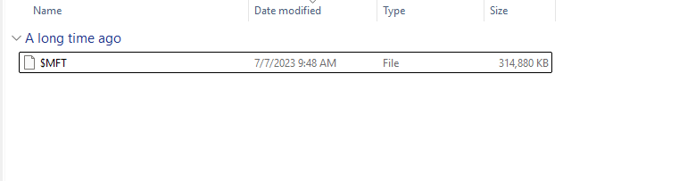

As an MFT file, it is not human-readable in its raw form; therefore, I converted it to CSV using the MFTECmd tool by Eric Zimmerman:

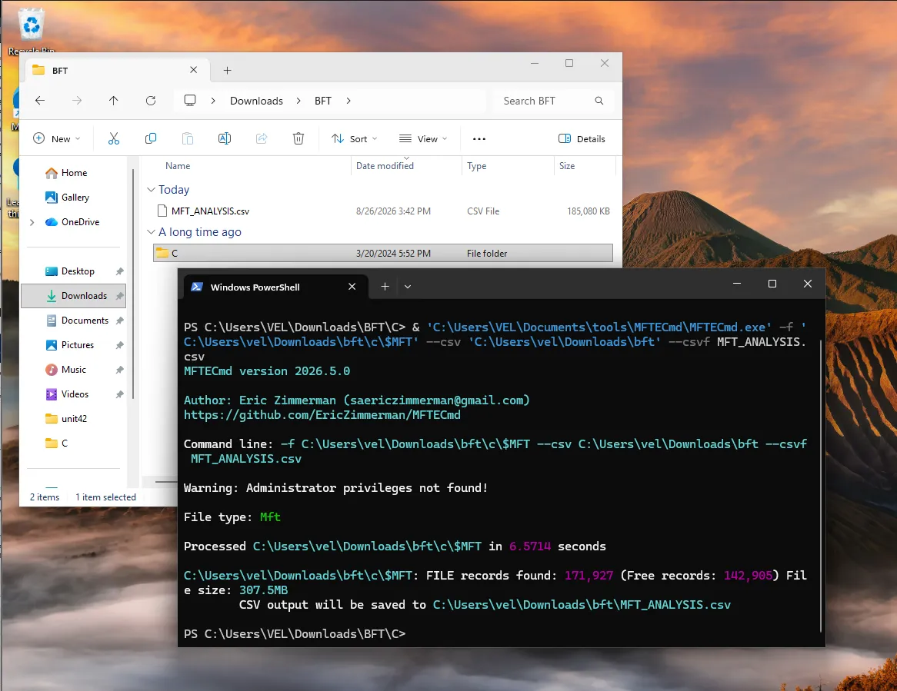

Now the file is easily readable, for instance, using the Timeline Explorer program:

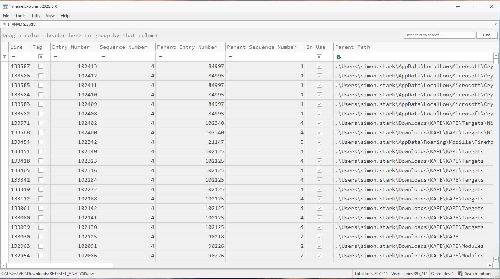

### Q & A

#### Task 1

***Simon Stark was targeted by attackers on February 13. He downloaded a ZIP file from a link received in an email. What was the name of the ZIP file he downloaded from the link?***

Using the Timeline Explorer and filtering for the asked date, 13 Feb 2024, and for `.zip` files, three files are found:

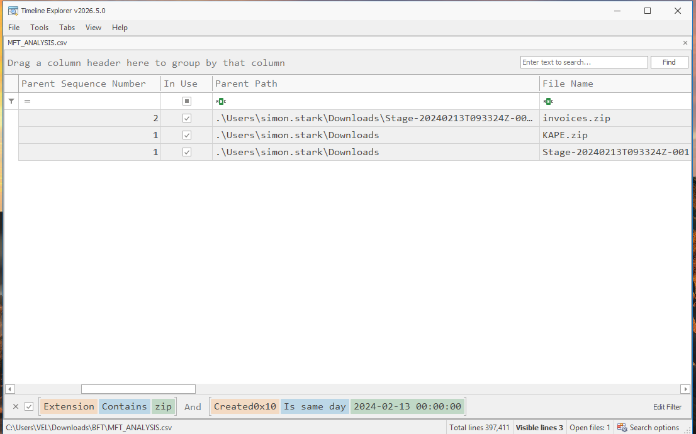

Since KAPE is Eric Zimmerman's toolset (Kroll Artifact Parser and Extractor), a different tool unrelated to this download, this one is discarded. Additionally, because `invoices.zip` appears after the Stage file, it is likely that `Stage-2024....zip` is the malicious file. **The answer is `Stage-20240213T093324Z-001.zip`.**

#### Task 2

***Examine the Zone Identifier contents for the initially downloaded ZIP file. This field reveals the HostUrl from where the file was downloaded, serving as a valuable Indicator of Compromise (IOC) in our investigation/analysis. What is the full Host URL from where this ZIP file was downloaded?***

This type of information, as the task states, is stored in the Zone Identifier as part of the ADS (Alternate Data Streams) when a file is downloaded from the internet. In essence, it is additional metadata generated upon download from the web.

I simply unmarked the `.zip` filter and searched for the filename "stage". Quickly, I found it right there:

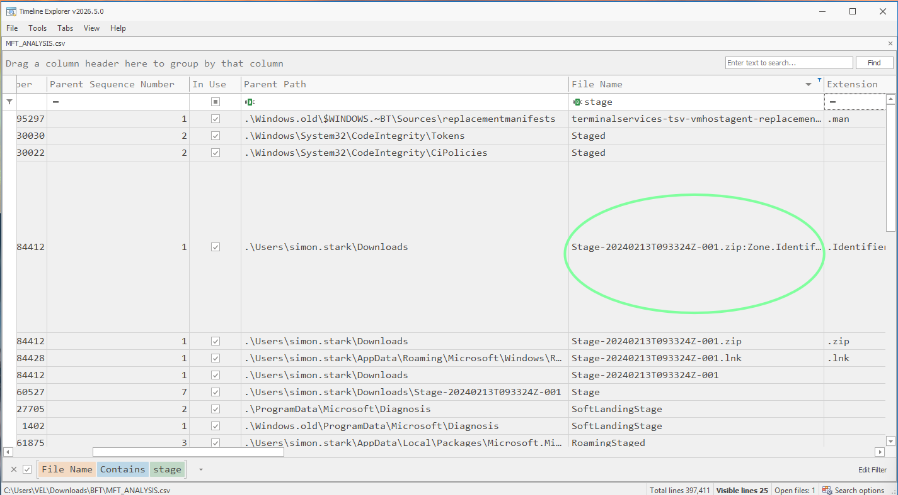

Then, I moved to the right and viewed the desired URL:

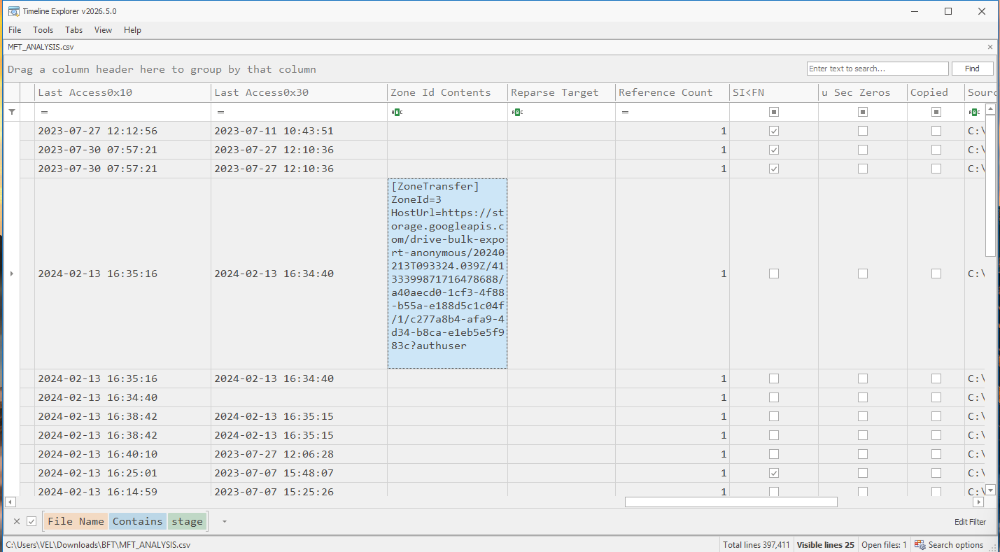

The answer is: **`https://storage.googleapis.com/drive-bulk-export-anonymous/20240213T093324.039Z/4133399871716478688/a40aecd0-1cf3-4f88-b55a-e188d5c1c04f/1/c277a8b4-afa9-4d34-b8ca-e1eb5e5f983c?authuser`**

#### Task 3

***What is the full path and name of the malicious file that executed malicious code and connected to a C2 server?***

I searched for any file contained in any path with the word "stage" in it. Around 16:34, the time the malicious ZIP was downloaded, I found an `invoice.bat` record with said filter:

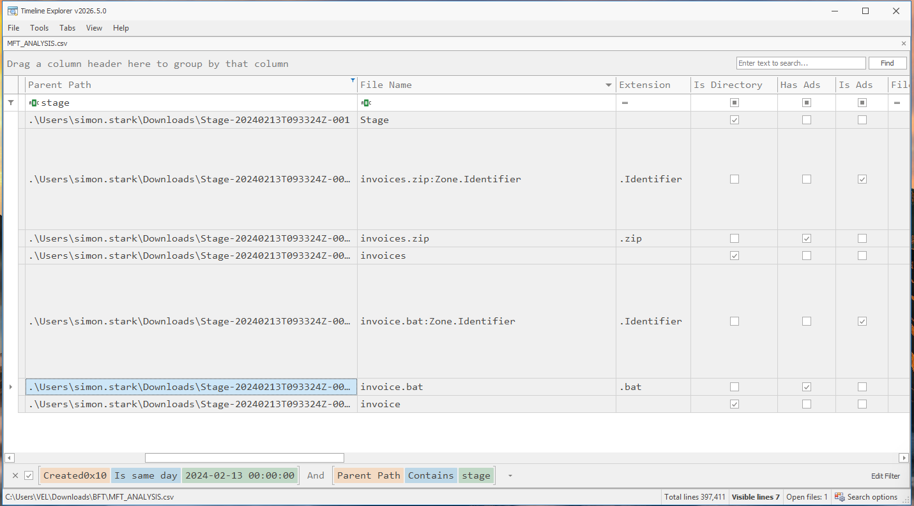

The answer is: **`C:\Users\simon.stark\Downloads\Stage-20240213T093324Z-001\Stage\invoice\invoices\invoice.bat`**

#### Task 4

***Analyze the $Created0x30 timestamp for the previously identified file. When was this file created on disk?***

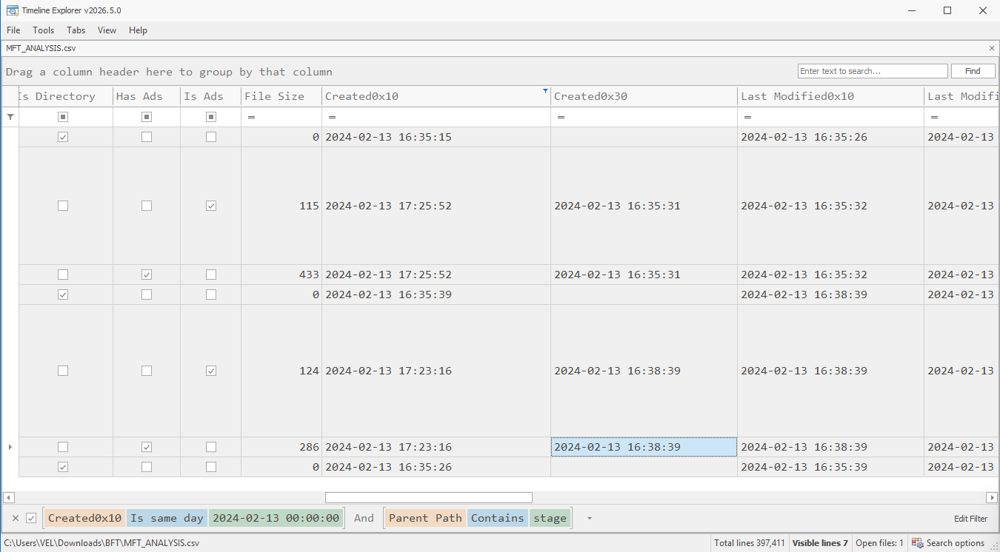

The `$Created0x30` date is: **`2024-02-13 16:38:39`**

#### Task 5

***Finding the hex offset of an MFT record is beneficial in many investigative scenarios. Find the hex offset of the stager file from Question 3.***

This question asks for the location (position) of the MFT record on the disk, expressed in hexadecimal. This is used to **locate and identify the exact MFT record on a disk/image** during forensic analysis.

Since the entry number for this specific MFT record is 23436 and each MFT record is 1024 bytes in size, I multiplied the record number by 1024.

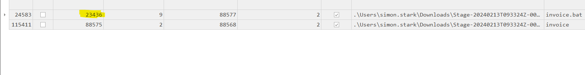

`23436 * 1024 = 23,998,464` bytes. However, this result is in decimal format and needed to be converted to hexadecimal.

For this purpose, I used CyberChef to convert the offset to the desired hexadecimal format:

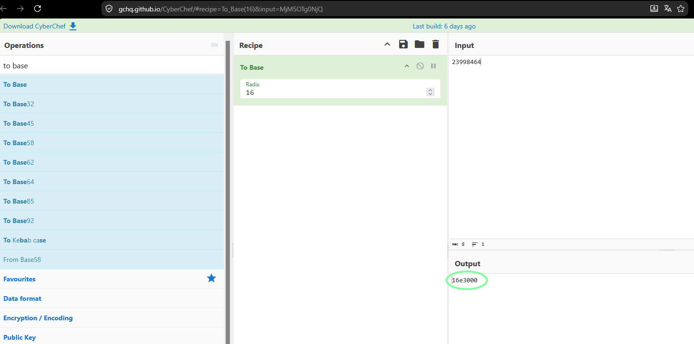

The answer is: **`16E3000`**

#### Task 6

***Each MFT record is 1024 bytes in size. If a file on disk has a size smaller than 1024 bytes, it can be stored directly within the MFT itself. These are called MFT Resident files. During Windows file system investigation, it is crucial to look for any malicious/suspicious files that may be resident in the MFT. This way, we can find the contents of malicious files/scripts. Find the contents of the malicious stager identified in Question 3 and answer with the C2 IP and port.***

Because the file is 286 bytes, which is less than 900 bytes, it indicates that the file contents are stored within the MFT itself.

I used a hex editor for this task, HxD. Immediately after the previously calculated offset, I found a PowerShell command that contained the C2 address and port.

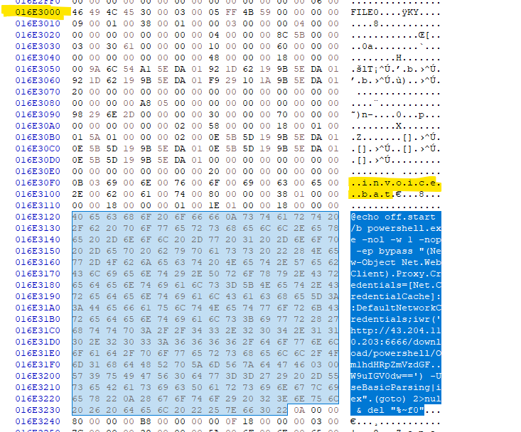

The answer is: **`43.204.110.203:6666`**.

## Incident Timeline

| Timestamp (UTC)     | Event                                      | Source | Notes                                                                                        |
| ------------------- | ------------------------------------------ | ------ | -------------------------------------------------------------------------------------------- |
| 2024-02-13 16:34:40 | Malicious Zip Download                     | MFT    | Stage-20240213T093324Z-001.zip Download                                                      |
| 2024-02-13 16:35:15 | Stage-20240213T093324Z-001.zip is unzipped | MFT    | Stage-20240213T093324Z-001.zip is unzipped                                                   |
| 2024-02-13 16:38:39 | invoice.bat gets unzipped                  | MFT    | The resident batch file invoice.bat ran PowerShell command connecting to 43.204.110.203:6666 |

## Lessons Learned / Key Findings / Important to remember

- **NTFS Forensics**  
Parsing the MFT with MFTECmd and filtering through Timeline Explorer allowed me to reconstruct the attack timeline with precision. By cross-referencing timestamps and file paths, I identified the initial ZIP download, its extraction, and ultimately the execution of the malicious payload. This case reinforced that a good understanding of MFT metadata is indispensable when tracing attacker activity across a Windows filesystem.

- **File Recovery**  
The malicious `invoice.bat` script was 286 bytes, well below the 1024-byte resident file threshold. Using the calculated hex offset for its MFT record, I extracted its contents directly from the MFT using HxD. Within the recovered script, I identified the PowerShell command containing the C2 IP and port. This technique proves particularly effective when files are small enough to be stored entirely within the MFT, as they remain recoverable regardless of their state on disk.

- **Disk Forensics**  
Effective forensic analysis demands a complementary toolset. I leveraged **MFTECmd** to parse and structure the data, Timeline Explorer to filter and correlate events, and HxD to recover resident file contents at the byte level. Additionally, examining the Zone Identifier ADS provided the HostUrl as a valuable IOC. 

## Related Techniques

| Technique                                                | ID        |
| -------------------------------------------------------- | --------- |
| Phishing: Spearphishing Attachment                       | T1566.001 |
| Ingress Tool Transfer                                    | T1105     |
| Command and Scripting Interpreter: Windows Command Shell | T1059.003 |