---
tags:
  - sherlock
  - dfir
difficulty: Very Easy
status: Completed
date: 04:45 pm - September 09, 2026
---

# Noxious

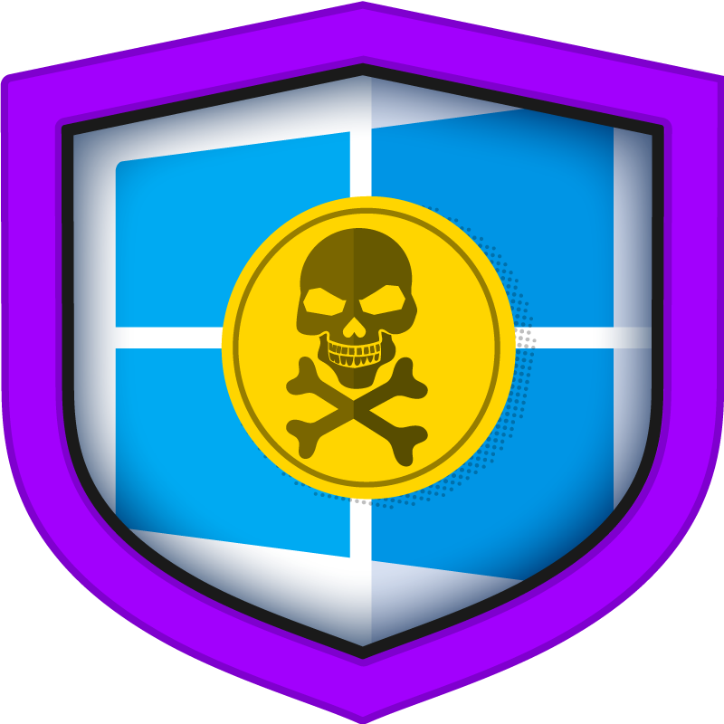

# Background
## Scenario

>The IDS device alerted us to a possible rogue device in the internal Active Directory network. The Intrusion Detection System also indicated signs of LLMNR traffic, which is unusual. It is suspected that an LLMNR poisoning attack occurred. The LLMNR traffic was directed towards Forela-WKstn002, which has the IP address 172.17.79.136. A limited packet capture from the surrounding time is provided to you, our Network Forensics expert. Since this occurred in the Active Directory VLAN, it is suggested that we perform network threat hunting with the Active Directory attack vector in mind, specifically focusing on LLMNR poisoning.

*%%LLMNR (Link-Local Multicast Name Resolution) is a Windows protocol that broadcasts name resolution queries when DNS fails. Because it lacks authentication, an attacker on the same local network can respond to these broadcasts, impersonating the requested host. The victim then attempts to authenticate, sending its NTLM hash to the attacker, who captures it for offline cracking or relaying to other systems.%%*
## Analysis

### Data

This lab provides exclusively a .pcap file:

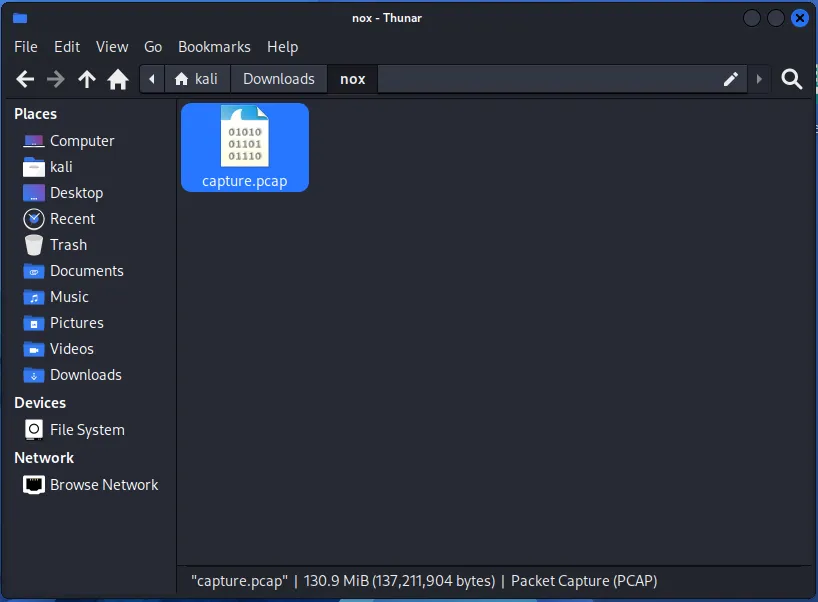

*A PCAP file (Packet Capture) is a binary format that stores captured network packets, preserving the original protocol headers and payloads for offline analysis.*

I opened it with Wireshark, this .pcap has tens of thousands of captured packets:

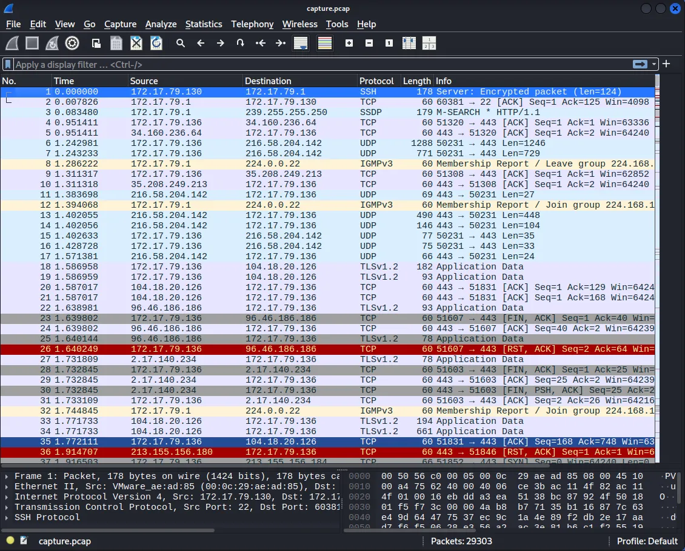

### Q & A

#### Task 1

***Its suspected by the security team that there was a rogue device in Forela's internal network running responder tool to perform an LLMNR Poisoning attack. Please find the malicious IP Address of the machine.***

First, since the UDP port for LLMNR traffic is 5355, I displayed the packets using such a filter, udp.port == 5355:

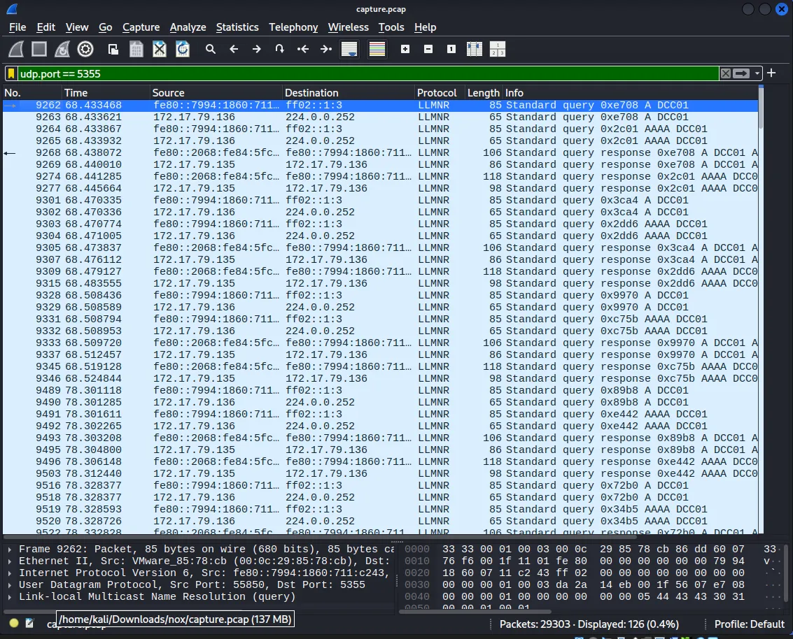

Right then, I activated the name resolutions in order to find the suspected device and its IP:

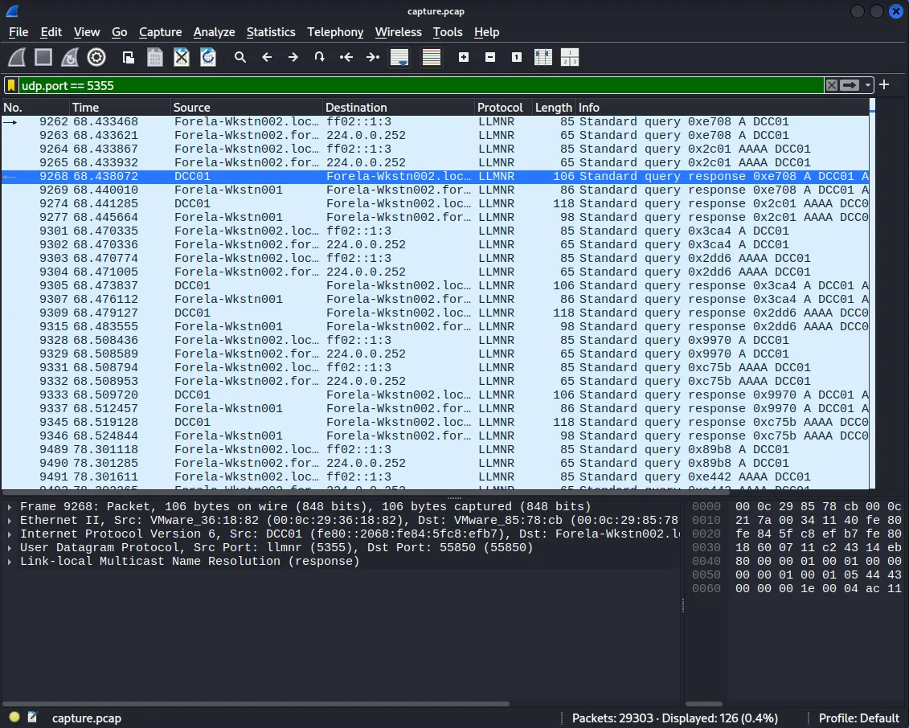

However, more context was needed: I proceeded to filter for DNS traffic (`dns`) and observed that the IP associated with `DC01` (dc01.forela.local) was handling multiple DNS requests. This confirmed the *legitimate Domain Controller* was `172.17.79.4`.

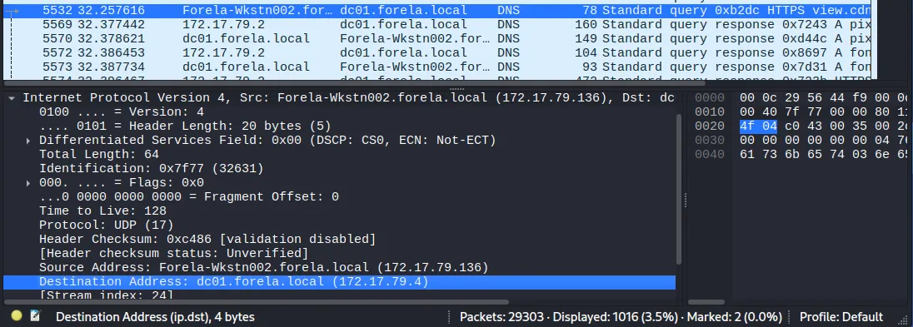

But, as seen in the first image of this task, the LLMNR poisoning attack must have happened over IPv6, using link-local addresses (`fe80::...`). This is a typical behavior, since Windows prioritizes IPv6 over IPv4.

Re-displaying now the capture with the UDP 5355 filter, paying attention I saw that the query was asked to DCC01, that's the typo it made the LLMNR attack possible:

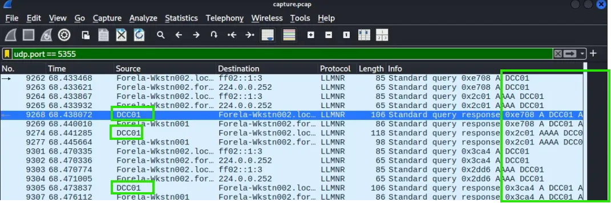

Noticing who is the attacker becomes even easier when filtering for that port and only with IPv4 packets (Forela-Wkstn002 is the victim, IP 172.17.79.136):

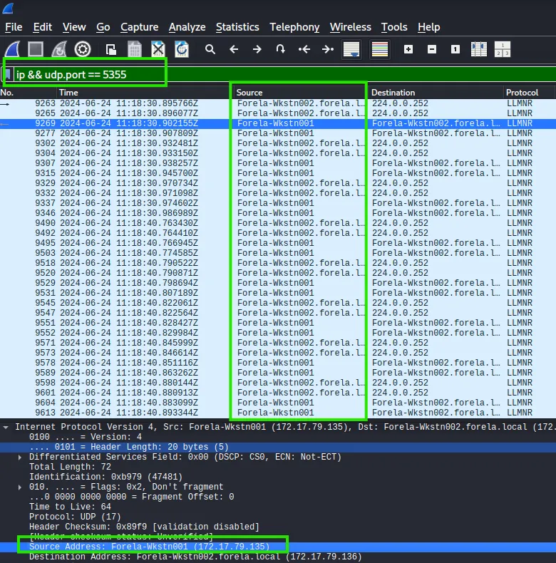

Then, and with `dc01` discarded as the fake Domain Control, I confirm Forela-Wkstn001 is the malicious attacker. The IP is: **172.17.79.135**

#### Task 2

***What is the hostname of the rogue machine?***

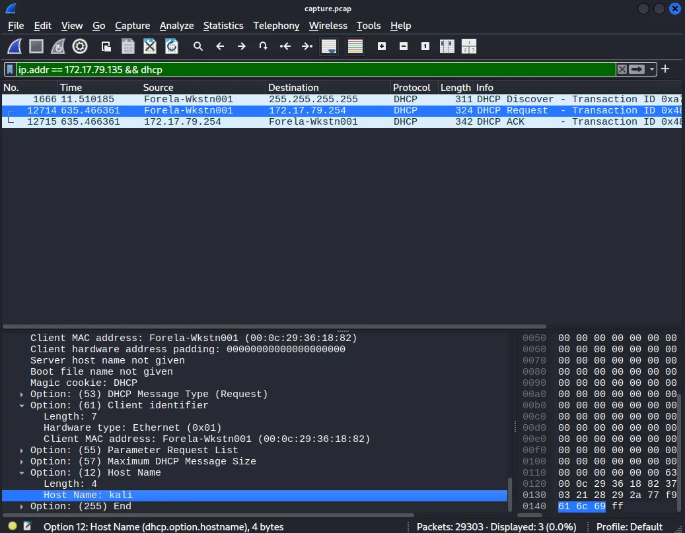

To get the answer, I correlated the DHCP packets with the found IP. The hostname was: **kali**.

#### Task 3

***Now we need to confirm whether the attacker captured the user's hash and it is crackable!! What is the username whose hash was captured?***

After a successful LLMNR poisoning, the victim (`172.17.79.136`) must attempt to connect to the attacker's fake share via SMB. To verify whether authentication was triggered, I analyzed the NTLM exchange over SMB:

1. **SMB Protocol Filtering:** Filtered for `smb2` (covering modern SMBv2/SMBv3 implementations).

2. **NTLM Handshake Inspection:** I looked for a `NTLMSSP_AUTH` (`Type 3`) packet sent by the victim.

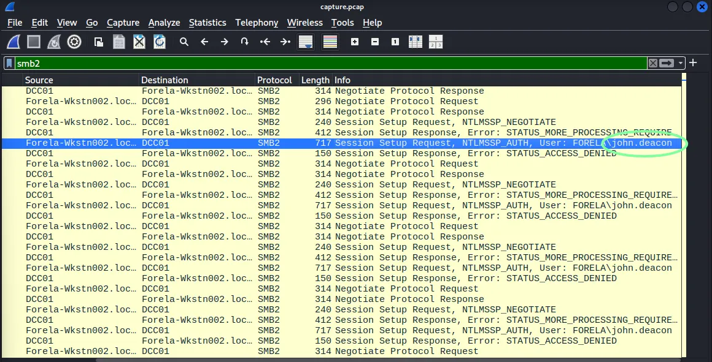

Inspecting the payload of the `NTLMSSP_AUTH` packet reveals the targeted account username is: **john.deacon**.

#### Task 4

***In NTLM traffic we can see that the victim credentials were relayed multiple times to the attacker's machine. When were the hashes captured the First time?***

By sorting the packets with the time in the UTC format and filtering for smb traffic, along with NTLM packets, I confirmed the time of the earliest packet was: **2024-06-24 11:18:30**

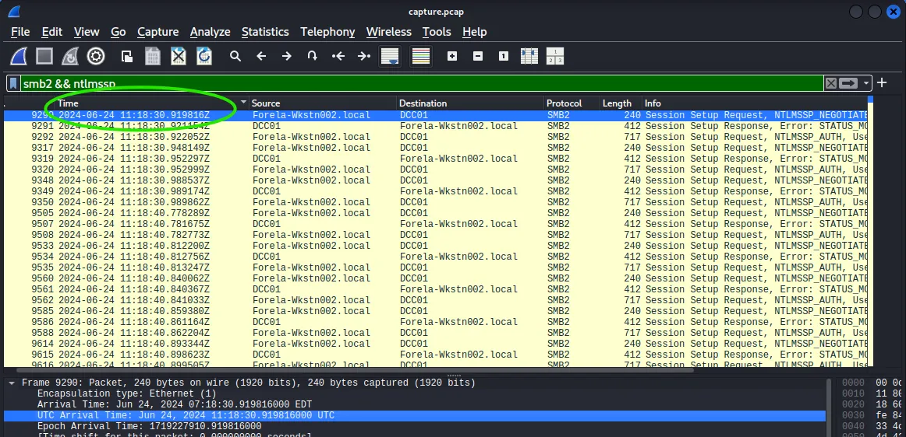

#### Task 5

***What was the typo made by the victim when navigating to the file share that caused his credentials to be leaked?***

As explained in Question 1, the typo was: **DCC01**:

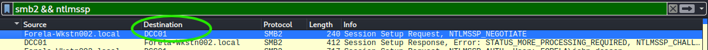

#### Task 6

***To get the actual credentials of the victim user we need to stitch together multiple values from the ntlm negotiation packets. What is the NTLM server challenge value?***

I expanded the *Security Blob* panel, there was the answer in the NTLM Server Challenge field: **601019d191f054f1**

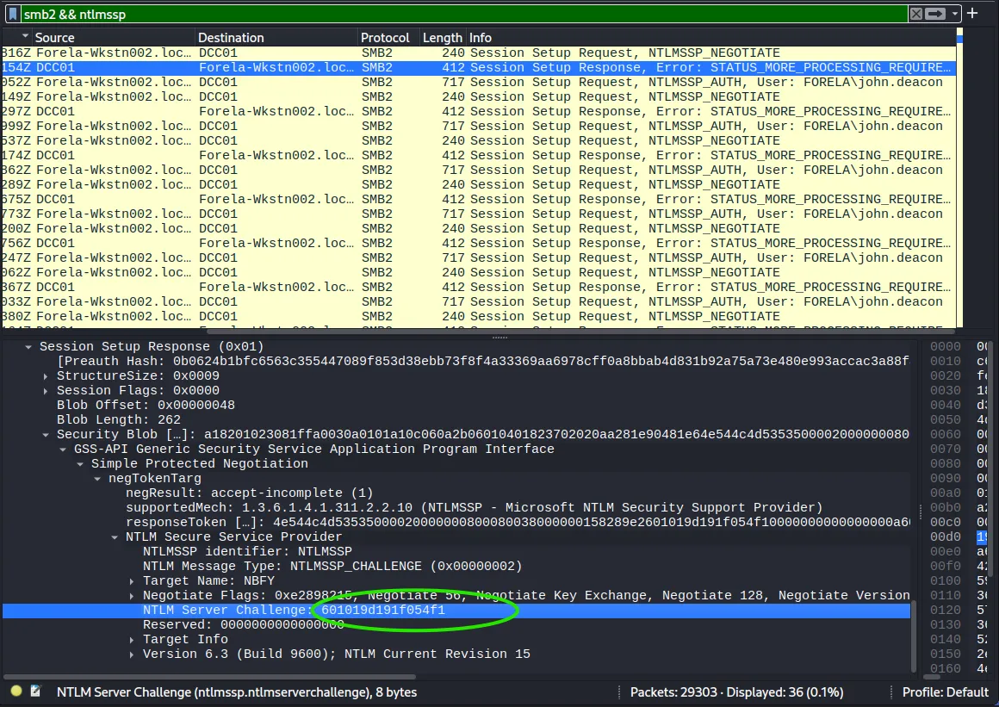

#### Task 7

***Now doing something similar find the NTProofStr value.***

While the Server Challenge is provided by the server, the **NTProofStr** is generated by the client (victim) as part of the `NTLMv2 Response`. It is a HMAC-MD5 hash that proves the user knows the password without sending it in cleartext.

I located this value by inspecting the **NTLMSSP_AUTH** (Type 3) packet details under the NTLMv2 Response section: **c0cc803a6d9fb5a9082253a04dbd4cd4**

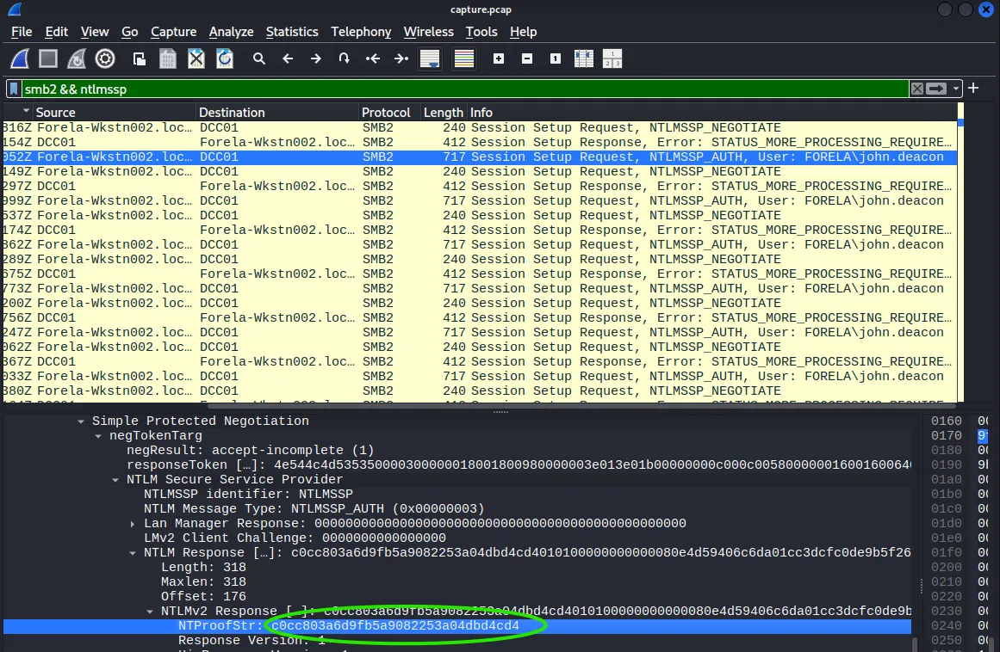


#### Task 8

***To test the password complexity, try recovering the password from the information found from packet capture. This is a crucial step as this way we can find whether the attacker was able to crack this and how quickly.***

NetNTLMv2 hashes follow a specific format for Hashcat (Mode 5600).

Since hashcat is pre-installed in the Kali distro:

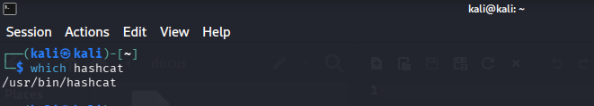

I unzipped the *wordlist* to use it later, with the following hash format:

**User::Domain:ServerChallenge:NTProofStr:NTLMv2Response(without first 16 bytes or 32 characters)**

I see I have:
- User -> john.deacon
- Domain -> FORELA (extracted from the NTLMSSP payload)
- ServerChallenge -> 601019d191f054f1
- NTProofStr ->c0cc803a6d9fb5a9082253a04dbd4cd4
- NTLMv2Response -> ~~c0cc803a6d9fb5a9082253a04dbd4cd4~~`01010000...` (The remaining data after removing the 32-character NTProofStr). 
  (The first 32 characters should be removed, since the NTProofStr is already written in this hash)

Putting it all together:
```
john.deacon::FORELA:601019d191f054f1:c0cc803a6d9fb5a9082253a04dbd4cd4:010100000000000080e4d59406c6da01cc3dcfc0de9b5f2600000000020008004e0042004600590001001e00570049004e002d00360036004100530035004c003100470052005700540004003400570049004e002d00360036004100530035004c00310047005200570054002e004e004200460059002e004c004f00430041004c00030014004e004200460059002e004c004f00430041004c00050014004e004200460059002e004c004f00430041004c000700080080e4d59406c6da0106000400020000000800300030000000000000000000000000200000eb2ecbc5200a40b89ad5831abf821f4f20a2c7f352283a35600377e1f294f1c90a001000000000000000000000000000000000000900140063006900660073002f00440043004300300031000000000000000000
```

I pasted the hash into a .txt:

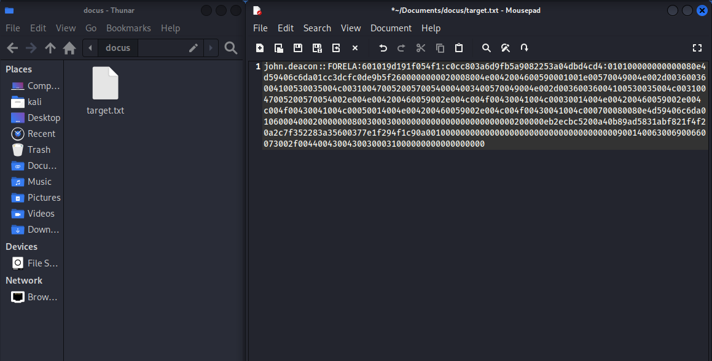

Then, I executed:
```bash
hashcat -a 0 -m 5600 target.txt /usr/share/wordlists/rockyou.txt
```

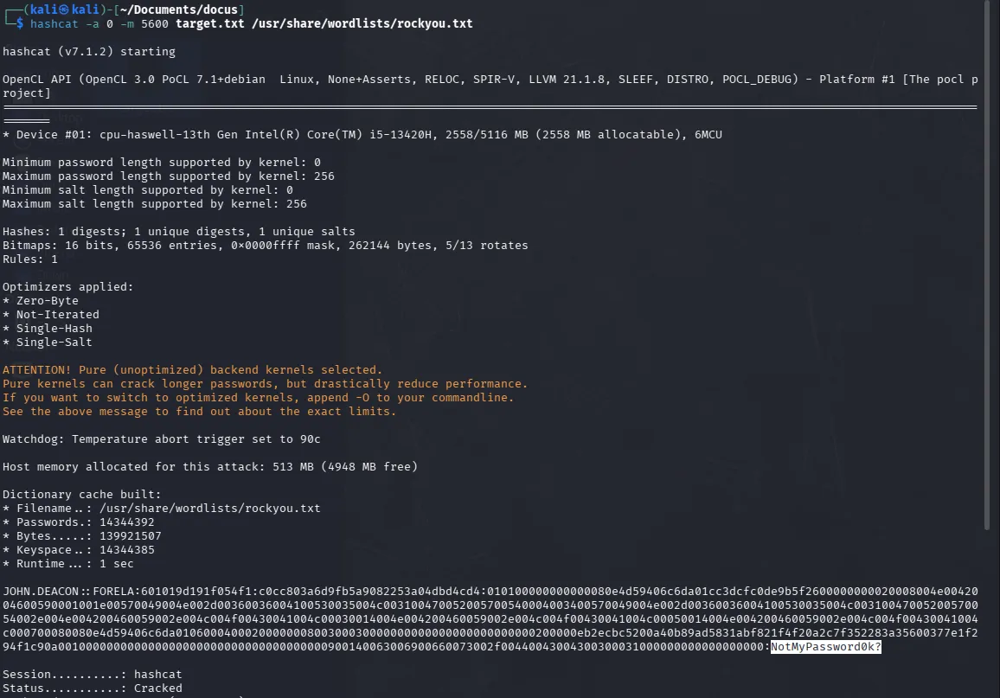

The targeted password, which was quickly cracked, was: **NotMyPassword0k?**

#### Task 9

***Just to get more context surrounding the incident, what is the actual file share that the victim was trying to navigate to?***

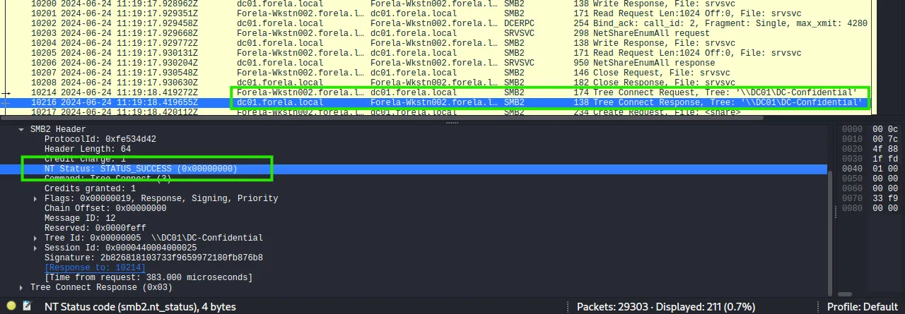

In SMB, connecting to a specific share is handled via **Tree Connect Request** commands. Once the victim realized the connection to `DCC01` failed, he successfully authenticated to the legitimate Domain Controller (`DC01`) at `11:19:18 UTC` (38 seconds after the initial credential capture).

The file share was: **`\\DC01\DC-Confidential`**


## Incident Timeline

| Timestamp (UTC)         | Event                       | Source          | Notes                                                              |
| :---------------------- | :-------------------------- | :-------------- | :----------------------------------------------------------------- |
| **2024-06-24 11:18:30** | Credential Capture          | `172.17.79.136` | Malicious response to `DCC01` query captured victim's NTLMv2 hash. |
| **2024-06-24 11:19:18** | Legitimate Share Connection | `172.17.79.136` | Victim later successfully connects to `\\DC01\DC-Confidential`.    |

## Lessons Learned / Key Findings / Important to remember

- **LLMNR Poisoning Risk:**  
  This investigation demonstrates how easily internal Windows authentication can be intercepted. By simply exploiting a hostname typo (`DCC01` instead of `DC01`), an attacker can force victims to authenticate against malicious shares. Disabling LLMNR/NBT-NS via Group Policy and enforcing SMB signing are essential defenses to prevent credential theft.

- **NTLM Handshake Forensics:**  
  Cracking hashes is a standard task, but understanding the underlying NTLMv2 structure is what enables the analysis. Recognizing the distinction between the `Server Challenge` and the `NTProofStr` is critical for manually building hashes for offline cracking tools like Hashcat, to further now whether the password could have been very easily cracked or not.

- **Network-Based Threat Hunting:**  
  The identification of the rogue machine relied on correlating UDP 5355 (LLMNR) traffic with anomalies in DNS resolution. Proactively filtering for such unusual traffic is a highly effective way to detect rogue devices running tools like *Responder* within an Active Directory VLAN.

## Related Techniques

| Technique                      | ID            |
| :----------------------------- | :------------ |
| LLMNR/NBT-NS Poisoning         | **T1557.001** |
| SMB/Windows Admin Shares       | **T1021.002** |
| Brute Force: Password Cracking | **T1110.002** |
