---
tags:
  - sherlock
  - dfir
difficulty: Very Easy
status: Completed
date: 11:54 am - August 13, 2026
---
# Unit42

# Background
## Scenario

> In this Sherlock, you will familiarize yourself with Sysmon logs and various useful EventIDs for identifying and analyzing malicious activities on a Windows system. Palo Alto's Unit42 recently conducted research on an UltraVNC campaign, wherein attackers utilized a backdoored version of UltraVNC to maintain access to systems. This lab is inspired by that campaign and guides participants through the initial access stage of the campaign.
>
> To answer the questions in this lab, you will only need the Event Viewer, with VirusTotal as an optional supplement. Below are some important Sysmon Event IDs that can be utilized in your analysis:
>
> - Event ID 1: Process Creation/Execution. Includes process path, parent process path, and command-line arguments.
> - Event ID 2: File Creation Time Changed. Includes the file making the change, the file to which the change is being made, tampered timestamp, and original timestamp.
> - Event ID 3: Network Connection. Includes the process making the connection, destination IP Address, and port.
> - Event ID 5: Process Termination. Includes the name of the process that was killed or terminated itself.
> - Event ID 11: File Created. Includes the process creating the file, the file being created, and its full path.
> - Event ID 22: DNS Query. Includes the process querying the domain, the target domain name, and the IP Addresses they resolve to.

## Analysis

### Data
First, I see the provided zip contains a sysmon file, an event log file:

### Q & A

#### Task 1

***How many Event logs are there with Event ID 11?***

For this Sherlock, I'll be using the Windows Event Viewer. Now, by filtering for the event 11 in the provided log file, it's pretty easy to spot the total number of such events, **56**.

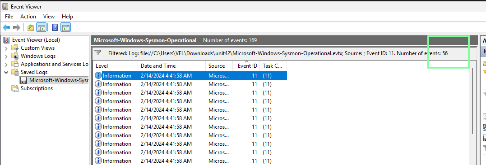

#### Task 2
***Whenever a process is created in memory, an event with Event ID 1 is recorded with details such as command line, hashes, process path, parent process path, etc. This information is very useful for an analyst because it allows us to see all programs executed on a system, which means we can spot any malicious processes being executed.*** 
***What is the malicious process that infected the victim's system?***

First, I'll check how many events with the Event ID 1 there are in the log file:

Since there are only six events of this type, I'll check them manually in Event Viewer for anything suspicious.

In the second event, the Details tab contains `technique_id=T1218`, which is associated with Signed Binary Proxy Execution. However, this alone does not indicate that the process is malicious, since `msiexec.exe` is a legitimate Windows executable.

Looking at the other fields, I find that `msiexec.exe` is being used to install an `.msi` file from an unusual location:

`CommandLine "C:\Windows\system32\msiexec.exe" /i "C:\Users\CyberJunkie\AppData\Roaming\Photo and Fax Vn\Photo and vn 1.1.2\install\F97891C\main1.msi"`

Finally, I checked the `ParentImage` field, which shows that the executable was launched from the user's Downloads folder:

**`ParentImage C:\Users\CyberJunkie\Downloads\Preventivo24.02.14.exe.exe`**

The process chain therefore shows:

`Preventivo24.02.14.exe.exe` → `msiexec.exe` → `main1.msi`

So to answer this particular question, the answer is: `C:\Users\CyberJunkie\Downloads\Preventivo24.02.14.exe.exe`

To further confirm that this is a malicious file, I retrieved the SHA256 hash from the `Preventivo24.02.14.exe.exe` event. The double `.exe` extension is also suspicious.
The hash is: `0CB44C4F8273750FA40497FCA81E850F73927E70B13C8F80CDCFEE9D1478E6F3`

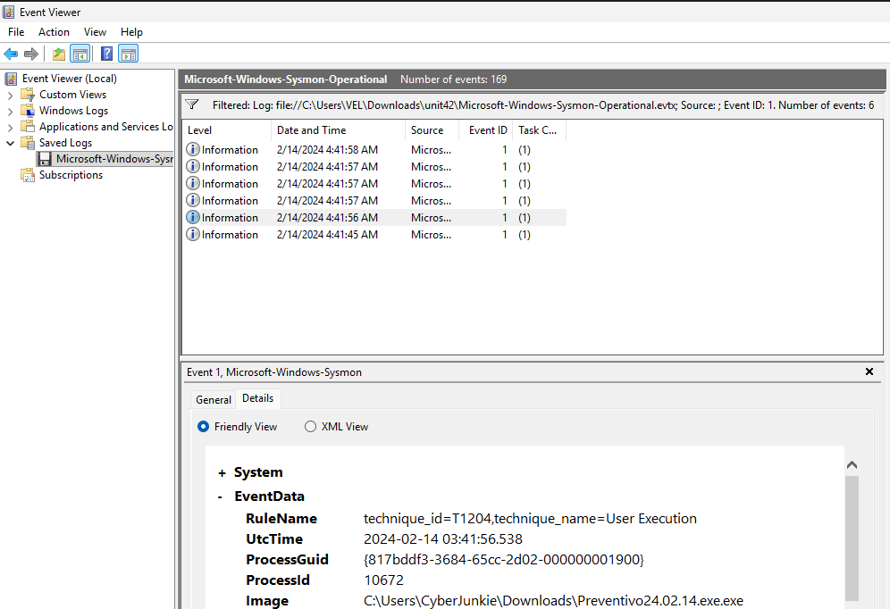

I then checked it in VirusTotal:

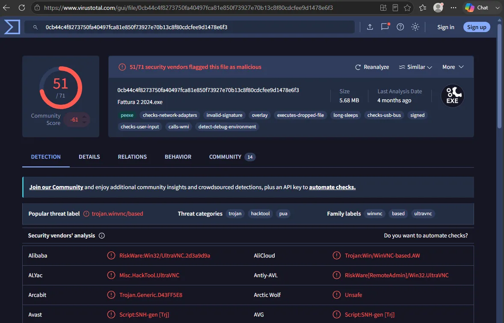

The file is heavily flagged in VirusTotal, providing strong evidence that `Preventivo24.02.14.exe.exe` is malicious.

#### Task 3

***Which Cloud drive was used to distribute the malware?***

 Although I initially intended to find the answer using Event ID 3, the only event returned did not provide any information about the specific cloud drive. 
 
 Then I looked for any other internet/cloud related Event ID, the Event ID 22. 
 
 As stated in the official Microsoft page, the ID 22 reflects the use of DNS queries:
 
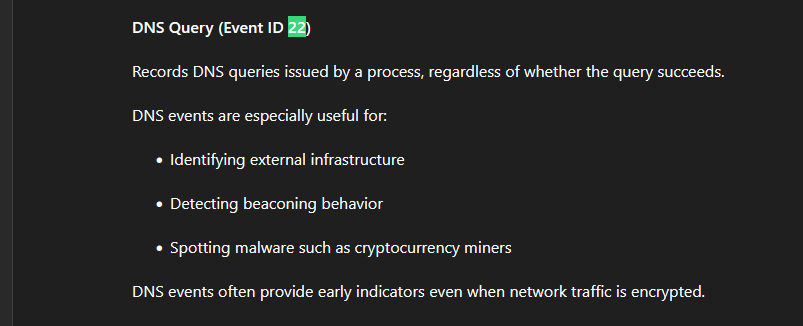

I then found three events, one of which showed "*dropbox*":

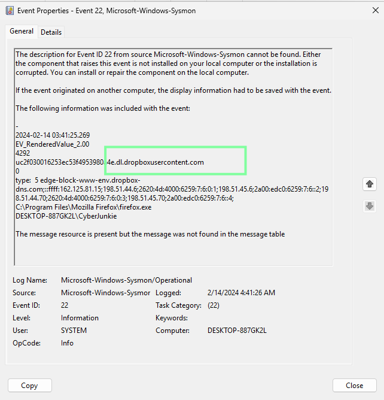

This indicated that the same `CyberJunkie` user had used Dropbox to download the malware. I checked the timestamp, which was 04:41:26. To look for file creation activity, or in this case the downloaded file, I used the Event ID 11 filter around that exact time:

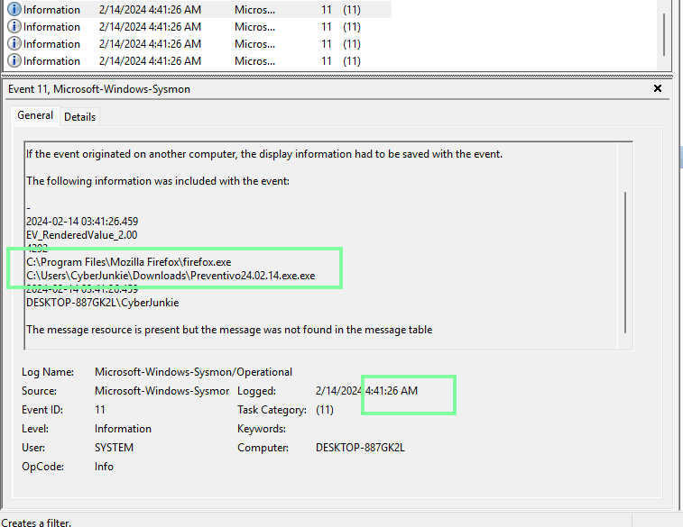

Therefore, **the answer is Dropbox**.

#### Task 4

***For many of the files it wrote to disk, the initial malicious file used a defense evasion technique called Time Stomping, where the file creation date is changed to make it appear older and blend in with other files. What was the timestamp changed to for the PDF file?***

Here, I simply filter for the Event ID 2, which is exactly made to look for these types of events:

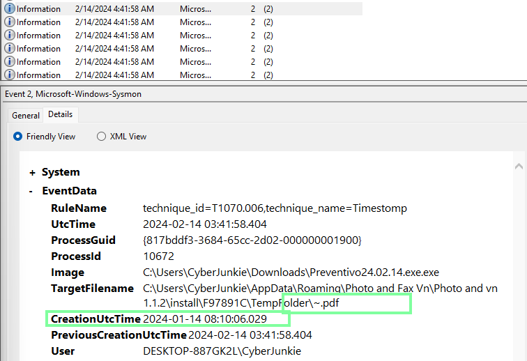

I quickly spot it, **the CreationTime is: 2024-01-14 08:10:06**.

#### Task 5

***The malicious file dropped a few files on disk. Where was "once.cmd" created on disk?***

Again by filtering for the Event ID 11, I see all these type of the events in which in one of them will be the answer. So, because there are 56 events of these type, I use Ctrl + f to look for this quickly. I found only two events containing `once.cmd`, the last of which was associated with the `CyberJunkie` user:

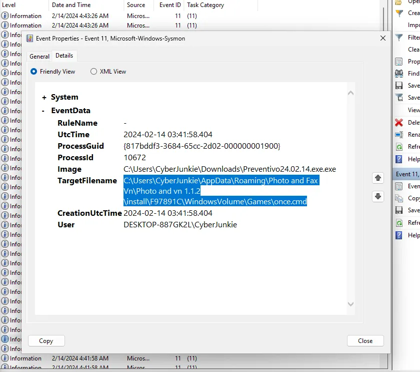

#### Task 6

***The malicious file attempted to reach a dummy domain, most likely to check the internet connection status. What domain name did it try to connect to?***

By filtering for the Event ID 22, it's clear in one of the 3 events showing that **the domain was `www.example.com`.**

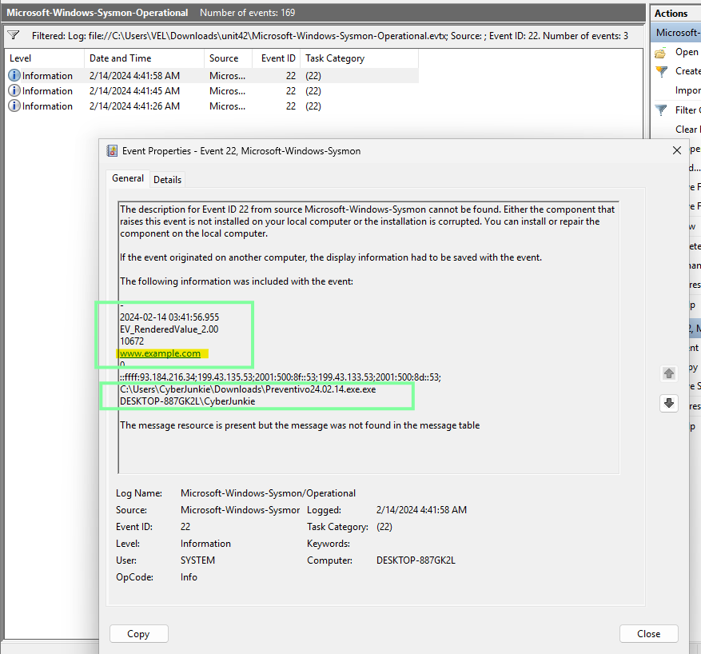

#### Task 7

***Which IP address did the malicious process try to reach out to?***

The Event ID 3 event identified earlier provides the answer: **`93.184.216.34`**

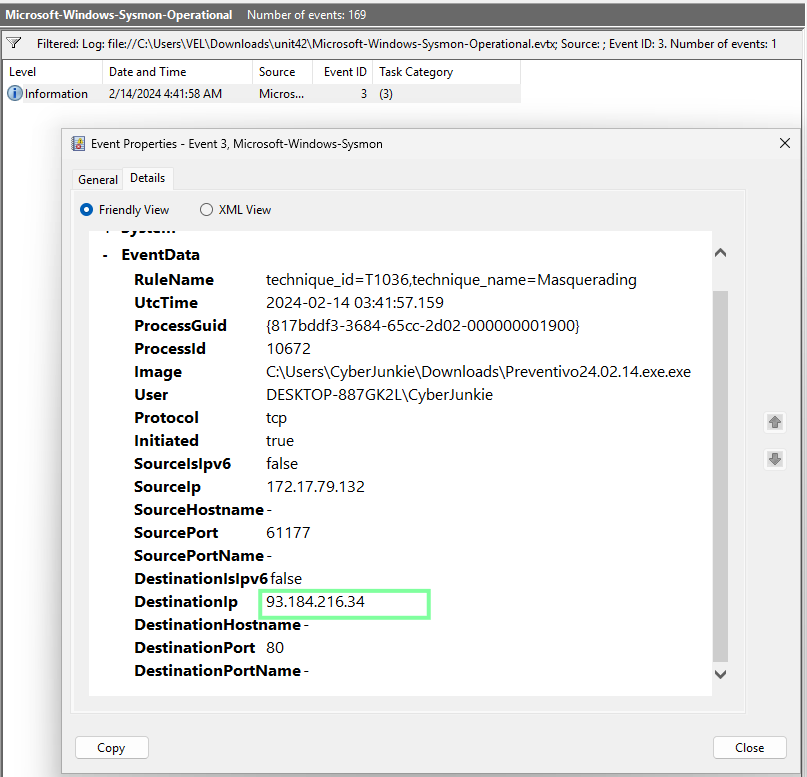

#### Task 8

***The malicious process terminated itself after infecting the PC with a backdoored variant of UltraVNC. When did the process terminate itself?***

To get the answer for this question, I'll have to filter for the Event ID 5, as it records process termination events:

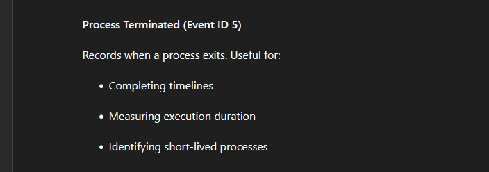

Only 1 event displayed when filtering, which contained:

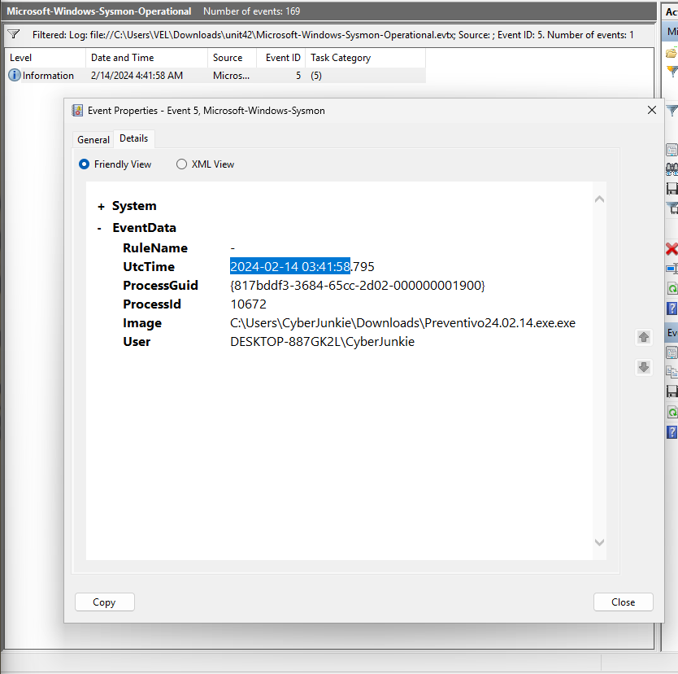

So **the answer is 2024-02-14 03:41:58**.

## Incident Timeline

| Timestamp (UTC)     | Event               | Source                     | Notes                               |
| ------------------- | ------------------- | -------------------------- | ----------------------------------- |
| 2024-02-14 03:41:26 | DNS query           | Firefox                    | Firefox DNS query for Dropbox       |
| 2024-02-14 03:41:26 | File Creation       | Firefox                    | Firefox malware download            |
| 2024-02-14 03:41:30 | File Creation       | Windows                    | Windows tags malware as downloaded  |
| 2024-02-14 03:41:45 | DNS query           | Firefox                    | Firefox DNS query for Dropbox       |
| 2024-02-14 03:41:56 | Process Creation    | Preventivo24.02.14.exe.exe | Preventivo24.02.14.exe.exe launched |
| 2024-02-14 03:41:57 | Process Creation    | Malware                    | Malware starts msiexec              |
| 2024-02-14 03:41:58 | File Creation       | Malware                    | Malware writes files to disk        |
| 2024-02-14 03:41:58 | Time Modification   | Malware                    | Malware timestamps 15 files         |
| 2024-02-14 03:41:58 | Network             | Malware                    | Malware connects to 93.184.216.34   |
| 2024-02-14 03:41:58 | DNS query           | Malware                    | Malware DNS query: www.example.com  |
| 2024-02-14 03:41:58 | Process Termination | Malware                    | Malware terminates itself           |

## Lessons Learned / Key Findings / Important to remember

- **Log Correlation Over Isolation:** Never analyze a single Event ID in isolation. Cross-reference Event ID 1 (process creation) with Event ID 11 (file creation) and Event ID 3 (network connections) to accurately document and investigate suspicious activity.

- **Effective Event Viewer Filtering:** Filtering by Event ID, timestamp, process name, and other relevant fields is crucial for quickly finding the data needed during an investigation.

## Related Techniques

| Technique      | ID            |
| -------------- | ------------- |
| User Execution | **T1204**     |
| Timestomp      | **T1070.006** |
